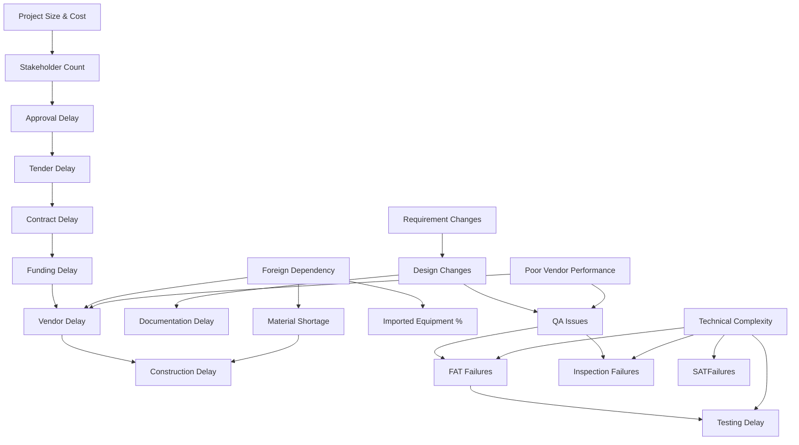

# Dataset Methodology: Ship Acquisition Delay Prediction System

This document outlines the design, statistical distributions, correlation chains, and nonlinear interactions implemented in the synthetic dataset generator for the Indian Navy Ship Acquisition Delay Risk Prediction System.

## 1. Rationale for Synthetic Data

Real-world military ship procurement datasets are:
1. **Classified or Sensitive**: Project timelines, cost figures, vendor ratings, and technical vulnerabilities of naval platforms are confidential.
2. **Scarce**: Naval acquisitions are major capital projects with low frequencies (dozens of projects over decades rather than thousands).
3. **Imbalanced & Incomplete**: Historical records often lack comprehensive and standardized granular metadata across all stages.

A structurally and statistically rigorous synthetic data generation framework is required to model procurement bottlenecks, test machine learning pipelines, and perform risk classification experiments safely.

---

## 2. Feature Definitions & Generation Methodology

The dataset generates approximately 35 project features representing the life-cycle of a naval ship acquisition:

| Feature Name | Type | Description | Distribution & Conditioning |
| :--- | :--- | :--- | :--- |
| **Project_ID** | String | Unique identifier | Pattern `IN-PRJ-XXXX` |
| **Ship_Type** | Categorical | Class of naval vessel | Weighted random sampling (see below) |
| **Project_Cost** | Float | Total cost in Crores (INR) | Triangular, conditioned on Ship Type |
| **Project_Size** | Float | Displacement (Tonnage / 1000) | Triangular, conditioned on Ship Type |
| **Planned_Duration** | Integer | Baseline project duration (months) | Triangular, conditioned on Ship Type |
| **Stakeholder_Count** | Integer | Total defense/govt agencies involved | Uniform, conditioned on Ship Type |
| **Technical_Complexity** | Float | Qualitative complexity index (1-10) | Triangular, conditioned on Ship Type |
| **Technology_Maturity** | Float | System readiness levels (1-10) | Triangular, conditioned on Ship Type |
| **Foreign_Dependency** | Boolean | Relying on foreign OEM systems | Bernoulli trials, conditioned on Ship Type |
| **Imported_Equipment** | Float | Percentage (%) of imported components | Beta distribution (shifted by foreign dependency) |
| **Historical_Vendor_Rating** | Float | Average rating of chosen vendors (1-5) | Triangular (centered around 3.8) |
| **Vendor_Performance** | Float | Real-time performance index (1-5) | Coupled with shortages & historical rating |
| **Delays (Various)** | Integer | Delays in days at specific stages | Poisson distribution, adjusted by chains |
| **Changes/Counts** | Integer | Counts of modifications or events | Poisson distribution |
| **Weather & Inflation** | Integer | External disruptions in days | Poisson distribution |

### Ship Type Conditioning Table
Each ship class is simulated with distinct physical, budgetary, and technology baselines:

* **Aircraft Carrier**: Extreme budget (35,000 Cr mode), long duration (120m mode), high complexity (9.5 mode), high stakeholder count, high foreign dependency.
* **Submarine**: Very high cost (22,000 Cr mode), high duration (96m mode), maximum complexity (9.2 mode), high foreign dependency.
* **Destroyer / Frigate**: Medium-high cost, medium-long duration, moderate-high complexity.
* **Corvette / Mine Counter Measure**: Medium cost/duration/complexity.
* **Fleet Support / OPV / Fast Attack**: Low cost, low duration, low complexity, high technology maturity.

---

## 3. Correlation Engine & Dependency Chains

The variables are not independent; they are bound together by a causal chain reflecting defense acquisition operations:

### Dependency Formulas:
1. **Administrative Cascade**:
   $$\text{Tender\_Delay} = \text{Poisson}(60) + 0.25 \times \text{Approval\_Delay}$$
   $$\text{Contract\_Delay} = \text{Poisson}(90) + 0.20 \times \text{Tender\_Delay}$$
   $$\text{Funding\_Delay} = \text{Poisson}(30) + 0.15 \times \text{Contract\_Delay}$$
2. **Technical Cascade**:
   $$\text{Design\_Changes} = \text{Poisson}(2) + 0.6 \times \text{Requirement\_Changes}$$
   $$\text{Documentation\_Delay} = \text{Poisson}(40) + 12 \times \text{Design\_Changes}$$
   $$\text{QA\_Issues} = \text{Poisson}(5) + 1.2 \times \text{Requirement\_Changes} + 0.8 \times \text{Design\_Changes}$$

---

## 4. Nonlinear and Threshold Effects

To move beyond simple linear models, the following nonlinear interaction rules are encoded:

* **Procurement Bottleneck**: If $\text{Approval\_Delay} > 120\text{ days}$ AND $\text{Foreign\_Dependency} = \text{True}$, then $\text{Vendor\_Delay}$ increases by an additional Poisson variable with $\lambda = 75$ days (due to lapsed vendor quotes and foreign exchange negotiations).
* **Requirement Explosion**: If $\text{Requirement\_Changes} > 5$, $\text{QA\_Issues}$ increases quadratically:
  $$\Delta \text{QA\_Issues} = 0.35 \times (\text{Requirement\_Changes} - 5)^2$$
* **Complexity Failures**: If $\text{Technical\_Complexity} > 8.0$, both $\text{FAT\_Failures}$ and $\text{SAT\_Failures}$ are inflated by a multiplier of **1.8x** (modeling extreme integration challenges in high-end weapon sensors).

---

## 5. Noise Injection

A controlled, zero-mean Gaussian noise is added to all continuous and delay variables:
$$X_{\text{noisy}} = X_{\text{correlated}} + \mathcal{N}(0, \sigma_{\text{noise}})$$
Where $\sigma_{\text{noise}}$ represents **5% to 10%** of the standard deviation of that specific variable. This simulates unmeasured variables (e.g. administrative staff changes, labor union strikes, local shipping conditions) and prevents perfect collinearity.

---

## 6. Hierarchical Delay Propagation Model

The final delay does not emerge from a single weight vector, but rather represents the chronological sum of stage delays:

1. **Administrative Delay Days** = $\text{Approval} + \text{Tender} + \text{Contract} + \text{Funding} + \text{Clearance}$
2. **Procurement Delay Days** = $\text{Vendor} + (0.4 \times \text{Documentation}) + (0.5 \times \text{Imported\_Equipment})$
3. **Construction Delay Days** = $\text{Construction} + \text{Weather} + \text{Inflation}$
4. **Testing Delay Days** = $\text{Testing} + (0.6 \times \text{Documentation})$
5. **Acceptance Delay Days** = $(8 \times \text{Inspection\_Failures}) + (15 \times \text{FAT\_Failures}) + (25 \times \text{SAT\_Failures}) + (2 \times \text{Stakeholders})$

$$\text{Total\_Delay\_Days} = \text{Admin\_Delay} + \text{Procurement\_Delay} + \text{Construction\_Delay} + \text{Testing\_Delay} + \text{Acceptance\_Delay}$$
$$\text{Delay\_Months} = \frac{\text{Total\_Delay\_Days}}{30.0}$$
$$\text{Delay\_Percentage} = \left( \frac{\text{Delay\_Months}}{\text{Planned\_Duration}} \right) \times 100$$

---

## 7. Risk Classification Tiers

Projects are automatically categorized into four risk categories using their final calculated `Delay_Percentage`:

* **Low Risk**: $\le 20\%$ delay.
* **Medium Risk**: $> 20\%$ and $\le 40\%$ delay.
* **High Risk**: $> 40\%$ and $\le 70\%$ delay.
* **Critical Risk**: $> 70\%$ delay.
