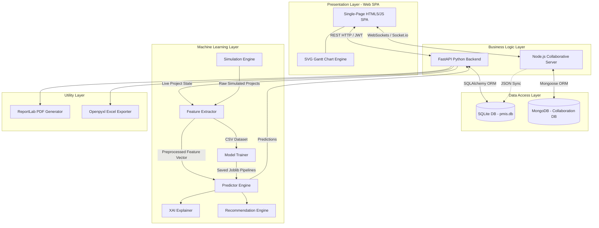
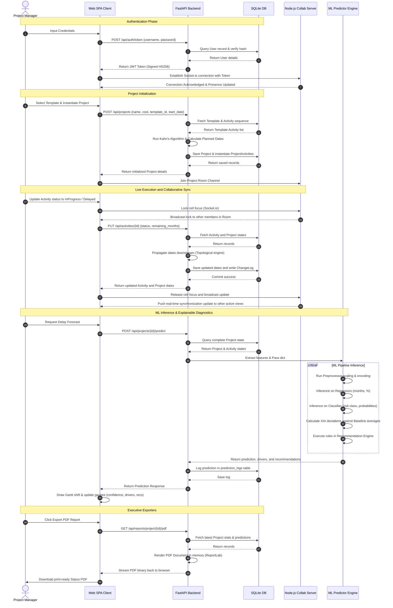

# TECHNICAL PROJECT REPORT

## Live Machine Learning Delay Risk Prediction and Critical Path Project Management Information System (PMIS) for Naval Vessel Acquisition Programs

---

### DOCUMENT CONTROL SHEET

| Document ID | Classification | Version | Date | Status |
| :--- | :--- | :--- | :--- | :--- |
| IN-PMIS-ML-2026-T01 | RESTRICTED | 2.0.0 | June 30, 2026 | Approved |

| Prepared By | Reviewed By | Approved By |
| :--- | :--- | :--- |
| Project Management Group (PMG) / Directorate of Naval Design (DND) | Senior Engineering Officers (Systems & Technology) | Controller of Warship Production & Acquisition (CWPA), Navy HQ |

---

## TABLE OF CONTENTS

1. [Abstract](#abstract)
2. [Introduction](#introduction)
3. [Literature Background](#literature-background)
4. [Overall System Architecture](#overall-system-architecture)
5. [Technology Stack](#technology-stack)
6. [Software Architecture](#software-architecture)
7. [Database Design](#database-design)
8. [User Management](#user-management)
9. [Project Template Management](#project-template-management)
10. [Project Scheduling Engine](#project-scheduling-engine)
11. [Delay Risk Prediction Methodology](#delay-risk-prediction-methodology)
12. [Synthetic Dataset Generation](#synthetic-dataset-generation)
13. [Feature Engineering](#feature-engineering)
14. [Machine Learning Pipeline](#machine-learning-pipeline)
15. [Prediction Engine](#prediction-engine)
16. [Explainable AI (XAI)](#explainable-ai-xai)
17. [Recommendation Engine](#recommendation-engine)
18. [API Design](#api-design)
19. [Frontend Design & User Experience](#frontend-design--user-experience)
20. [Report Generation & Exporters](#report-generation--exporters)
21. [Security & Compliance](#security--compliance)
22. [System Workflow](#system-workflow)
23. [Technical and Operational Advantages](#technical-and-operational-advantages)
24. [Current Limitations](#current-limitations)
25. [Future Scope](#future-scope)
26. [Conclusion](#conclusion)
27. [Appendix: System Installation and Deployment](#appendix-system-installation-and-deployment)

---

## ABSTRACT

### Problem Statement
Large-scale naval ship acquisition programs are highly capital-intensive, logistically complex, multi-year endeavors characterized by intricate networks of sequential and parallel activities. Traditional project management information systems (PMIS) rely on static, deterministic planning frameworks (e.g., Gantt charts and spreadsheet logs). These tools fail to model the non-linear propagation of delays across the project network, cannot forecast downstream schedule impacts before they manifest, and lack predictive modeling capacities for final handover dates under highly uncertain defense supply chains and technical requirements.

### Existing Problems in Naval Project Management
1. **Static Predecessor Cascades**: Delays in administrative phases, such as Approval of Necessity (AoN) or Technical Evaluation Committee (TEC) clearances, must be manually calculated and updated. This leads to outdated project networks.
2. **Deterministic Scheduling Assumptions**: Traditional planning tools assume average activity durations, failing to incorporate asymmetric delay distributions caused by technical failures, weather impacts, or supply bottlenecks.
3. **No Proactive Predictive Foresight**: Traditional systems record delays reactively. Project monitoring groups cannot identify the cumulative risk profile or predict the final commissioning date of a ship early in its building cycle.
4. **Lack of Steerage Guidance**: Raw delays are flagged without correlating the root causes (e.g., vendor performance, technical complexity) to strategic, context-aware remedial decisions.

### Motivation
Naval defense preparedness relies heavily on the timely induction of combat platforms. Delays in shipyards result in operational deficits and multi-crore cost overruns. Building an automated system that integrates **Critical Path Method (CPM)** algorithms with **Machine Learning (ML)** models allows the Indian Navy to transition from reactive monitoring to proactive risk mitigation.

### Proposed Solution
This project details the development of an enterprise-grade, web-based Project Management Information System (PMIS) with integrated ML-driven delay forecasting. The system combines a dynamic topological scheduler with an ensemble regression and classification pipeline (XGBoost, Random Forests, and Gradient Boosting). It dynamically updates planned schedules, estimates final commissioning delay durations and percentages, classifies projects into risk categories, isolates top risk drivers using Explainable AI (XAI), and serves context-aware strategic steering recommendations to shipyard managers and Navy headquarters.

### Major Contributions
* **Topological Downstream Cascading Engine**: Implemented Kahn's algorithm for topological sorting to propagate live execution delays across the network dynamically.
* **Dual-Engine ML Prediction**: Deployed optimized models to predict continuous delay durations (in months), delay percentages, and categorical risk tiers (Low, Medium, High, Critical) simultaneously.
* **Explainable AI (XAI) Diagnostic Module**: Formulated a feature-deviation analysis engine using model importances to isolate the top 5 delay drivers for any live project snapshot.
* **Dynamic Rule-Based Steering Engine**: Implemented a contextual recommendation engine mapping project health, critical path delays, vendor ratings, and regulatory requirements directly to strategic actions.
* **Collaborative Architecture**: Developed a Node.js/MongoDB-based parallel synchronization service enabling multi-user project co-editing, activity locks, and real-time alerts.

### Key Features
1. **Interactive SVG Gantt Chart**: Dynamic, client-side rendering of project schedules, predecessors, progress margins, milestones, and critical paths.
2. **Lifecycle Template Builder**: Reusable workflow templates (e.g., Nomination, Competitive, Indigenous, Emergency) with direct DAG verification.
3. **Automated Document Exporters**: Dynamic PDF status reports via ReportLab and custom Excel matrices via openpyxl.
4. **High-Fidelity Project Simulator**: Day-by-day project lifecycle simulation using lognormal and triangular probability distributions for ML training dataset generation.

### Expected Benefits
Implementing this system minimizes delivery uncertainty by providing early warning signals (up to 3 years before handover). It enhances shipyard resource allocation, reduces administrative clearance cycle times through automated escalations, and ensures high strategic availability of combat fleets.

---

## INTRODUCTION

### Ship Acquisition Projects
Naval warship construction is an industrial process spanning several phases:

```
[ Conception & Feasibility ] ➔ [ Approval of Necessity (AoN) ] ➔ [ RFP Issue & Bidding ]
                                                                       ↓
[ Steel Cutting / Keel Laying ] ⬷ [ Contract & Negotiations ] ⬷ [ Tech Evaluation (TEC) ]
            ↓
[ Hull Assembly & Outfitting ] ➔ [ Harbor Trials (HAT) ] ➔ [ Sea Trials (SAT) ] ➔ [ Commissioning ]
```

Each phase exhibits different operational variables. Administrative steps depend on bureaucratic processes; hull fabrication depends on labor, raw steel supply, and weather; combat system integration depends on software maturity and foreign equipment import clearances.

### Delay Management Challenges
Warship programs involve hundreds of vendors, multiple government clearances, and complex engineering integration. Delays are asymmetric: an activity is rarely completed significantly early, but can be delayed by hundreds of days due to quality failures, custom holds on long-lead items (e.g., propulsion gearboxes, gas turbines), or integration challenges in weapon-sensor suites.

### Need of Predictive Project Management
Naval project monitors require a system that acts as an "early-warning radar". If an administrative delay of 120 days occurs during the initial design approval phase, the system must not only shift the Gantt bars but also run ML inference to predict how this delay cascades downstream, accounting for the shipyard's capacity, technical complexity, and vendor quality profile.

### Why Conventional Tools are Insufficient
Traditional PMIS tools like Microsoft Project or Primavera are deterministic. While they support CPM cascading, they do not learn from historical project data. They treat a delay in "Steel Cutting" the same way whether the ship is a highly complex Aircraft Carrier with high foreign dependencies, or a standard Offshore Patrol Vessel (OPV) built with local materials. Machine learning models bridge this gap by predicting delay magnitudes based on multidimensional historical parameters.

### Objectives
1. Build a functional, web-based project management platform with template creation, activity tracking, and dynamic delay propagation.
2. Construct a machine learning pipeline that trains regression and classification models on simulated naval acquisition cycles.
3. Establish Explainable AI diagnostics to show project managers exactly why a project is flagged as "High" or "Critical" risk.
4. Create an automated report generation system to export print-ready PDF briefs and Excel files for review meetings.

### Scope
The software scope spans:
* **Backend API**: A high-performance Python FastAPI service.
* **Database**: Lightweight relational storage using SQLite with SQLAlchemy ORM.
* **ML Core**: Training models on 27 project-state features extracted from simulated project snapshots.
* **Frontend**: HTML5/JS single-page application using Tailwind CSS for UI layout and custom SVGs for Gantt rendering.
* **Collab Engine**: A Node.js socket server for multi-user coordination.

---

## LITERATURE BACKGROUND

### Traditional Project Management
The Critical Path Method (CPM) and Project Evaluation and Review Technique (PERT) were developed in the late 1950s. CPM focuses on identifying the sequence of critical, zero-float activities that directly determine the minimum project duration:

$$T_{\text{project}} = \max_{P \in \mathcal{P}} \sum_{i \in P} d_i$$

where $\mathcal{P}$ represents the set of all paths from the start node to the end node in the project network DAG, and $d_i$ is the duration of activity $i$.

PERT introduced probability distributions for activity durations, defining them via optimistic ($a$), nominal ($m$), and pessimistic ($b$) parameters. The expected duration $\mu_i$ and variance $\sigma_i^2$ are calculated as:

$$\mu_i = \frac{a + 4m + b}{6}, \quad \sigma_i^2 = \left(\frac{b - a}{6}\right)^2$$

While PERT provides a probabilistic project duration estimate, it fails to dynamically adapt to live daily execution events or model vendor capacity bottlenecks.

### Machine Learning in Project Management
Recent research focuses on using historical databases to predict project success. However, public datasets on military acquisitions are highly restricted. This project addresses this by designing a high-fidelity execution simulator that procedure-generates datasets utilizing lognormal and triangular probability distributions.

### Explainable AI (XAI)
In high-stakes military decision-making, "black-box" models are rejected by project managers who must justify resource reallocations. Explainable AI methods, such as SHAP (SHapley Additive exPlanations) or local feature deviation analysis, are used to explain individual predictions:

$$g(z') = \phi_0 + \sum_{j=1}^{M} \phi_j z'_j$$

where $g$ is the explanation model, $z'_j \in \{0, 1\}^M$ represents a binary feature coalition vector, and $\phi_j \in \mathbb{R}$ is the Shapley value (attribution) of feature $j$. This project implements a feature-deviation analysis approach, normalizing live feature values against a baseline dataset and weighting the deviations by model feature importances to isolate local risk drivers.

### Recommendation Systems
Project steering requires prescriptive analytics alongside predictive models. The recommendation engine implements a rule-based expert system mapping project-state vectors to strategic interventions. When the prediction engine flags a project as "Critical" risk, the recommendation engine parses the risk attributions to suggest specific managerial offsets, such as labor reallocations, design baseline freezes, or supply chain escalations.

---

## OVERALL SYSTEM ARCHITECTURE

The platform uses a modular, decoupled architecture consisting of two primary backend services (FastAPI and Node.js Collaborative Service), an SQLite database, a Python machine learning pipeline, and a Single-Page App (SPA) frontend.



### Components

#### Presentation Layer (Frontend)
The SPA client is built using Tailwind CSS for UI layout and vanilla JavaScript. It manages application state via a global reactive `store` object and renders an interactive SVG Gantt chart. It communicates with the backend via REST endpoints and maintains a real-time socket connection for collaborative presence and edits.

#### Business Logic Layer (Backend Services)
* **Python FastAPI Service**: Handles core business logic, including template CRUD, project instantiation, topological scheduling date calculations, PDF/Excel generation, and ML model inference.
* **Node.js Collaborative Server**: Manages WebSocket connections via Socket.io. It handles user presence, real-time activity lock coordination, comment logs, document attachments, and pushes real-time activity changes to online clients.

#### Data Access Layer (Database)
* **SQLite (via SQLAlchemy)**: Relational database storing users, templates, live projects, activities, audit logs, and prediction logs.
* **MongoDB (via Mongoose)**: Document-oriented database for the collaboration engine, storing comments, attached documents, user notifications, and active project workspace states.

#### Machine Learning Layer (ML Pipeline)
* **High-Fidelity Simulator**: Day-by-day project simulator that models shipyard execution under uncertainty.
* **Feature Extractor**: Transforms project snapshots into 27-dimensional feature vectors.
* **Model Pipeline**: Contains trained preprocessors, regression models for delay month and percentage forecasting, and a multi-class risk classifier.
* **Explainable AI (XAI)**: Calculates local feature deviations from baseline averages to identify risk drivers.
* **Recommendation Engine**: Rules engine that maps project states and prediction drivers to strategic recommendations.

#### Utility Layer (Exporters)
Generates downloadable project reports. Uses **ReportLab** for print-ready PDFs and **openpyxl** for detailed Excel spreadsheets containing active project schedules and prediction histories.

---

## TECHNOLOGY STACK

```
┌──────────────────────────────────────────────────────────┐
│                     TECHNOLOGY STACK                     │
├───────────────────────┬──────────────────────────────────┤
│ Core Language         │ Python 3.10+                     │
├───────────────────────┼──────────────────────────────────┤
│ Backend API           │ FastAPI (Uvicorn server)         │
├───────────────────────┼──────────────────────────────────┤
│ Collaboration Backend │ Node.js (Express & Socket.io)    │
├───────────────────────┼──────────────────────────────────┤
│ Relational Database   │ SQLite (via SQLAlchemy ORM)      │
├───────────────────────┼──────────────────────────────────┤
│ Collaboration DB      │ MongoDB (via Mongoose ODM)       │
├───────────────────────┼──────────────────────────────────┤
│ Machine Learning      │ Scikit-Learn, XGBoost, Pandas    │
├───────────────────────┼──────────────────────────────────┤
│ Frontend              │ HTML5, Vanilla JavaScript, CSS   │
├───────────────────────┼──────────────────────────────────┤
│ Reporting & Utilities │ ReportLab (PDF), openpyxl        │
├───────────────────────┼──────────────────────────────────┤
│ Containerization      │ Docker, Docker-Compose           │
└───────────────────────┴──────────────────────────────────┘
```

### Rationale for Technology Selection
1. **FastAPI**: Selected for its native asynchronous capabilities, automatic Pydantic request/response validation, and auto-generated OpenAPI documentation. It provides low-latency execution and integrates easily with Python-based ML libraries.
2. **SQLite & SQLAlchemy**: SQLite is chosen for its zero-configuration local database engine, suitable for deployment in sandboxed environments or naval vessel local local area networks (LANs). SQLAlchemy abstracts database access, enabling migration to PostgreSQL or MS SQL Server by changing the connection string.
3. **Node.js & Socket.io**: Used for real-time state synchronization, user presence tracking, and cell-level locks. Node's event-driven, non-blocking I/O model handles concurrent WebSocket connections efficiently.
4. **XGBoost**: Extreme Gradient Boosting is used because it handles tabular datasets with non-linear interactions, supports regularization to prevent overfitting, and provides high performance on tabular data.
5. **Tailwind CSS**: A utility-first CSS framework that allows building a responsive dashboard without writing custom CSS classes, maintaining design consistency.
6. **ReportLab & openpyxl**: Python libraries that allow programmatic document generation directly in memory, serving PDF/Excel files to the user as streaming responses without disk storage overhead.

---

## SOFTWARE ARCHITECTURE

The application uses a layered software architecture to enforce separation of concerns, improve testability, and simplify maintenance.

```
┌────────────────────────────────────────────────────────┐
│                   PRESENTATION LAYER                   │
│         Single Page SPA, Custom SVG Gantt Engine       │
└───────────────────────────┬────────────────────────────┘
                            │ (JSON over HTTP / JWT)
                            ▼
┌────────────────────────────────────────────────────────┐
│                     BUSINESS LAYER                     │
│        FastAPI Routers, Node.js Collaborative Controller│
└───────────────────────────┬────────────────────────────┘
                            │ (Direct Calls / Services)
                            ▼
┌────────────────────────────────────────────────────────┐
│                   DATA ACCESS LAYER                    │
│        SQLAlchemy Models (Relational), Mongoose ODM    │
└───────────────┬───────────────────────────┬────────────┘
                │                           │
                ▼                           ▼
┌───────────────────────────────┐ ┌──────────────────────┐
│           ML LAYER            │ │    UTILITY LAYER     │
│   Inference, XAI Explainer,   │ │   ReportLab (PDF),   │
│     Recommendation Engine     │ │   openpyxl (Excel)   │
└───────────────────────────────┘ └──────────────────────┘
```

### Presentation Layer
The presentation layer is located in [index.html](file:///f:/ShipDelayPrediction/backend/static/index.html). It handles view routing, reactive layout rendering, form validations, and asynchronous HTTP client communication. It maps the user interaction flows onto corresponding backend routes.

### Business Layer
The business layer processes request payloads, coordinates database transactions, enforces business validation rules, and manages scheduling calculations.
* **Template Service** ([template_service.py](file:///f:/ShipDelayPrediction/backend/services/template_service.py)): Implements DAG dependency checks, template duplication, and activity mapping.
* **Project Service** ([project_service.py](file:///f:/ShipDelayPrediction/backend/services/project_service.py)): Implements project instantiation and metadata updates.
* **Activity Service** ([activity_service.py](file:///f:/ShipDelayPrediction/backend/services/activity_service.py)): Coordinates live activity status changes and updates project-level dates.

### Data Access Layer
Maps relational database tables and JSON documents to Python objects and JS classes. Database operations are handled using session transactions.

### Machine Learning Layer
Extracts tabular features from active projects, scales numeric variables, transforms categories, and queries models to return predictions, feature importances, and recommendations.

### Utility Layer
Contains helper libraries that convert active memory objects into PDF documents and Excel files.

---

## DATABASE DESIGN

The relational database architecture is defined in the `backend/models` directory. It uses a normalized structure to represent templates, projects, activities, audit trails, and prediction logs.

```mermaid
erDiagram
    USERS ||--o{ PROJECT_TEMPLATES : "creates"
    USERS ||--o{ PROJECTS : "manages"
    USERS ||--o{ ACTIVITY_CHANGE_LOGS : "logs edits by"
    PROJECT_TEMPLATES ||--o{ ACTIVITY_TEMPLATES : "defines"
    PROJECTS ||--o{ PROJECT_ACTIVITIES : "contains"
    PROJECTS ||--o{ PREDICTION_LOGS : "records"
    PROJECT_ACTIVITIES ||--o{ ACTIVITY_CHANGE_LOGS : "audits"

    USERS {
        int id PK
        string username UNIQUE
        string email UNIQUE
        string hashed_password
        string full_name
        string role "Admin | ProjectManager | Viewer"
        boolean is_active
        boolean is_first_login
        datetime created_at
        datetime updated_at
    }

    PROJECT_TEMPLATES {
        int id PK
        string name UNIQUE
        string description
        int created_by FK
        boolean is_archived
        json feedback_loops
        datetime created_at
        datetime updated_at
    }

    ACTIVITY_TEMPLATES {
        int id PK
        int template_id FK
        string name
        string description
        string category "Administrative | Technical | Procurement | Construction | Inspection | Testing | Delivery | Documentation | Other"
        int sequence_number
        int parallel_group
        json dependency_list "Array of sequence numbers"
        int default_duration_months
        float historical_risk_weight
        string responsible_department
        boolean is_milestone
        boolean is_critical_path
        datetime created_at
    }

    PROJECTS {
        int id PK
        string project_name
        string project_id_code UNIQUE
        string ship_name
        string ship_class
        string ship_type
        float project_cost "Crores INR"
        string customer
        int project_manager_id FK
        int template_id FK
        date start_date
        date expected_end_date
        string priority "Low | Medium | High | Critical"
        string current_status "Planning | Active | OnHold | Completed | Cancelled"
        json feedback_loops
        datetime created_at
        datetime updated_at
    }

    PROJECT_ACTIVITIES {
        int id PK
        int project_id FK
        int activity_template_id FK
        string name
        string category
        int sequence_number
        int parallel_group
        json dependency_list "Array of ProjectActivity IDs"
        date planned_start_date
        date planned_end_date
        date actual_start_date
        date actual_end_date
        string current_status "NotStarted | InProgress | Completed | Delayed | Blocked | Cancelled"
        float completion_percentage
        string assigned_department
        string assigned_officer
        text remarks
        int current_delay_days
        float duration_months
        float remaining_months
        float historical_risk_weight
        string predicted_risk "Low | Medium | High | Critical"
        boolean is_milestone
        boolean is_critical_path
        datetime created_at
        datetime updated_at
    }

    PREDICTION_LOGS {
        int id PK
        int project_id FK
        datetime predicted_at
        float project_progress_pct
        float delay_percentage
        float delay_months
        string risk_category
        float confidence
        json top_drivers
        json recommendations
    }

    ACTIVITY_CHANGE_LOGS {
        int id PK
        int activity_id FK
        string field_changed
        text old_value
        text new_value
        int changed_by FK
        text change_reason
        datetime changed_at
    }
```

### Table Schema Definitions

#### Users Table (`users`)
Stores authorization credentials and access roles.
* `id` (INTEGER, Primary Key, Auto-increment)
* `username` (VARCHAR(100), Unique, Indexed, Not Null)
* `email` (VARCHAR(255), Unique, Nullable)
* `hashed_password` (VARCHAR(255), Not Null)
* `full_name` (VARCHAR(255), Nullable)
* `role` (ENUM: `Admin`, `ProjectManager`, `Viewer`, Not Null)
* `is_active` (BOOLEAN, Default True, Not Null)
* `is_first_login` (BOOLEAN, Default True, Not Null)
* `created_at` (DATETIME, Default UTC now, Not Null)
* `updated_at` (DATETIME, Default UTC now, Auto-updates, Not Null)

#### Project Templates Table (`project_templates`)
Stores reusable master workflow architectures.
* `id` (INTEGER, Primary Key, Auto-increment)
* `name` (VARCHAR(255), Unique, Indexed, Not Null)
* `description` (TEXT, Nullable)
* `created_by` (INTEGER, Foreign Key to `users.id`, Nullable)
* `is_archived` (BOOLEAN, Default False, Not Null)
* `feedback_loops` (JSON list of loops, Nullable)
* `created_at` (DATETIME, Default UTC now, Not Null)
* `updated_at` (DATETIME, Default UTC now, Auto-updates, Not Null)

#### Activity Templates Table (`activity_templates`)
Defines activities belonging to a project template.
* `id` (INTEGER, Primary Key, Auto-increment)
* `template_id` (INTEGER, Foreign Key to `project_templates.id` with CASCADE delete, Not Null)
* `name` (VARCHAR(255), Not Null)
* `description` (TEXT, Nullable)
* `category` (VARCHAR(50), Default "Other", Not Null)
* `sequence_number` (INTEGER, Not Null)
* `parallel_group` (INTEGER, Nullable)
* `dependency_list` (JSON list of sequence number integers, Default empty list, Not Null)
* `default_duration_months` (INTEGER, Default 1, Not Null)
* `historical_risk_weight` (FLOAT, Default 50.0, Not Null)
* `responsible_department` (VARCHAR(100), Nullable)
* `is_milestone` (BOOLEAN, Default False, Not Null)
* `is_critical_path` (BOOLEAN, Default False, Not Null)
* `created_at` (DATETIME, Default UTC now, Not Null)

#### Projects Table (`projects`)
Represents active ship acquisition project instances.
* `id` (INTEGER, Primary Key, Auto-increment)
* `project_name` (VARCHAR(255), Indexed, Not Null)
* `project_id_code` (VARCHAR(50), Unique, Indexed, Not Null)
* `ship_name` (VARCHAR(255), Nullable)
* `ship_class` (VARCHAR(100), Nullable)
* `ship_type` (VARCHAR(100), Nullable)
* `project_cost` (FLOAT, Nullable)
* `customer` (VARCHAR(255), Nullable)
* `project_manager_id` (INTEGER, Foreign Key to `users.id`, Nullable)
* `template_id` (INTEGER, Foreign Key to `project_templates.id`, Nullable)
* `start_date` (DATE, Nullable)
* `expected_end_date` (DATE, Nullable)
* `priority` (ENUM: `Low`, `Medium`, `High`, `Critical`, Default `Medium`, Not Null)
* `current_status` (ENUM: `Planning`, `Active`, `OnHold`, `Completed`, `Cancelled`, Default `Planning`, Not Null)
* `feedback_loops` (JSON list of loops, Default empty list, Nullable)
* `created_at` (DATETIME, Default UTC now, Not Null)
* `updated_at` (DATETIME, Default UTC now, Auto-updates, Not Null)

#### Project Activities Table (`project_activities`)
Stores the execution state of project activities.
* `id` (INTEGER, Primary Key, Auto-increment)
* `project_id` (INTEGER, Foreign Key to `projects.id` with CASCADE delete, Not Null)
* `activity_template_id` (INTEGER, Foreign Key to `activity_templates.id`, Nullable)
* `name` (VARCHAR(255), Not Null)
* `category` (VARCHAR(50), Default "Other", Not Null)
* `sequence_number` (INTEGER, Not Null)
* `parallel_group` (INTEGER, Nullable)
* `dependency_list` (JSON list of `project_activities.id` integers, Default empty list, Not Null)
* `planned_start_date` (DATE, Nullable)
* `planned_end_date` (DATE, Nullable)
* `actual_start_date` (DATE, Nullable)
* `actual_end_date` (DATE, Nullable)
* `current_status` (ENUM: `NotStarted`, `InProgress`, `Completed`, `Delayed`, `Blocked`, `Cancelled`, Default `NotStarted`, Not Null)
* `completion_percentage` (FLOAT, Default 0.0, Not Null)
* `assigned_department` (VARCHAR(100), Nullable)
* `assigned_officer` (VARCHAR(255), Nullable)
* `remarks` (TEXT, Nullable)
* `current_delay_days` (INTEGER, Default 0, Not Null)
* `duration_months` (FLOAT, Default 1.0, Not Null)
* `remaining_months` (FLOAT, Default 1.0, Not Null)
* `historical_risk_weight` (FLOAT, Default 50.0, Not Null)
* `predicted_risk` (VARCHAR(50), Nullable)
* `is_milestone` (BOOLEAN, Default False, Not Null)
* `is_critical_path` (BOOLEAN, Default False, Not Null)
* `created_at` (DATETIME, Default UTC now, Not Null)
* `updated_at` (DATETIME, Default UTC now, Auto-updates, Not Null)

#### Prediction Logs Table (`prediction_logs`)
Stores historical prediction records for trend analysis.
* `id` (INTEGER, Primary Key, Auto-increment)
* `project_id` (INTEGER, Foreign Key to `projects.id` with CASCADE delete, Not Null)
* `predicted_at` (DATETIME, Default UTC now, Not Null)
* `project_progress_pct` (FLOAT, Nullable)
* `delay_percentage` (FLOAT, Nullable)
* `delay_months` (FLOAT, Nullable)
* `risk_category` (VARCHAR(50), Nullable)
* `confidence` (FLOAT, Nullable)
* `top_drivers` (JSON structure listing driving features and weights, Nullable)
* `recommendations` (JSON structure listing steering guidance cards, Nullable)

#### Activity Change Logs Table (`activity_change_logs`)
Stores audit records for modifications made to activities.
* `id` (INTEGER, Primary Key, Auto-increment)
* `activity_id` (INTEGER, Foreign Key to `project_activities.id` with CASCADE delete, Not Null)
* `field_changed` (VARCHAR(100), Not Null)
* `old_value` (TEXT, Nullable)
* `new_value` (TEXT, Nullable)
* `changed_by` (INTEGER, Foreign Key to `users.id`, Nullable)
* `change_reason` (TEXT, Nullable)
* `changed_at` (DATETIME, Default UTC now, Not Null)

---

## USER MANAGEMENT

Access control uses standard JSON Web Tokens (JWT) for authentication and a Role-Based Access Control (RBAC) model.

### Role Categorizations

```
  ┌──────────────────────────────────────────────────────────┐
  │                        USER ROLES                        │
  ├──────────────────────────────────────────────────────────┤
  │   Admin ──► ProjectManager ──► Viewer                    │
  │   (Full     (Write Access,     (Read-Only,               │
  │    Access)   No User Mgmt)      No Actions)              │
  └──────────────────────────────────────────────────────────┘
```

#### 1. Admin
* **Description**: Authorized system administrator.
* **Permissions**:
  * Read/Write access to all projects, activities, and templates.
  * Trigger pipeline training execution.
  * System user account management.
  * System configurations overrides.

#### 2. Project Manager (ProjectManager)
* **Description**: Shipyard project manager or monitoring officer.
* **Permissions**:
  * Access to projects and templates.
  * Instantiate projects and edit activities (status, dates, remarks).
  * Request ML delay predictions.
  * Generate and export project reports.
  * *Restrict*: Cannot manage users or modify master templates.

#### 3. Viewer
* **Description**: Auditing personnel or senior naval officers.
* **Permissions**:
  * Read-only access to dashboards, project states, Gantt charts, and prediction logs.
  * *Restrict*: Cannot edit fields, execute templates, trigger predictions, or modify user accounts.

### Permission Mapping Table

| Endpoint / Operation | Admin | ProjectManager | Viewer |
| :--- | :---: | :---: | :---: |
| GET `/api/dashboard/*` | Yes | Yes | Yes |
| GET `/api/projects/*` | Yes | Yes | Yes |
| POST `/api/projects/create` | Yes | Yes | No |
| PUT `/api/projects/{id}` | Yes | Yes | No |
| DELETE `/api/projects/{id}` | Yes | No | No |
| PUT `/api/activities/{id}` | Yes | Yes | No |
| POST `/api/projects/{id}/predict` | Yes | Yes | No |
| POST `/api/templates/create` | Yes | No | No |
| GET `/api/reports/*` | Yes | Yes | Yes |
| POST `/api/auth/register` | Yes | No | No |

---

## PROJECT TEMPLATE MANAGEMENT

Project templates define master activity sequences, durations, dependencies, and risk profiles. They are designed to prevent project duplication.

```
       MASTER LIFESTAGE TEMPLATE DEFINITION (DAG)
┌───────────────────────────────────────────────────────────────┐
│ [AoN Clearance] (Seq: 1, Cat: Admin, Dur: 6m, Risk: 35%)     │
└──────────────┬────────────────────────────────────────────────┘
               │ (Predecessor)
               ▼
┌───────────────────────────────────────────────────────────────┐
│ [Staff Requirements] (Seq: 2, Cat: Technical, Dur: 3m)        │
└──────────────┬────────────────────────────────────────────────┘
               │ (Predecessor)
               ▼
┌───────────────────────────────────────────────────────────────┐
│ [Commercial Negotiations (CNC)] (Seq: 3, Cat: Procure, Dur: 5m)│
└───────────────────────────────────────────────────────────────┘
```

### Template Creation & Structure
Templates are defined using [ActivityTemplate](file:///f:/ShipDelayPrediction/backend/models/template.py) instances connected to a [ProjectTemplate](file:///f:/ShipDelayPrediction/backend/models/template.py). When creating a template:
1. The user defines template metadata (name, description, feedback loops).
2. The user registers activities, specifying for each:
   * **Name & Category**: e.g., Keel Laying (Category: Construction).
   * **Sequence Number**: Integer defining position in the flow.
   * **Dependency List**: Sequence numbers of immediate predecessors.
   * **Default Duration**: Expected execution duration in months.
   * **Historical Risk Weight**: Prior probability of delay (0 to 100).
   * **Is Milestone / Is Critical Path**: Logical flags.

### Dependency Graph Validation (DAG Verification)
Templates must not contain circular dependencies. Before committing to the database, the backend runs Kahn's topological sorting algorithm on the activity sequence. If a cycle is detected, database instantiation is aborted.

```python
def validate_dependency_dag(activities: List[dict]) -> Tuple[bool, str]:
    seq_numbers = {a["sequence_number"] for a in activities}
    adj = defaultdict(list)
    in_degree = defaultdict(int)

    for a in activities:
        seq = a["sequence_number"]
        in_degree.setdefault(seq, 0)
        for dep in a.get("dependency_list", []):
            if dep not in seq_numbers:
                return False, f"Activity {seq} depends on non-existent sequence {dep}"
            adj[dep].append(seq)
            in_degree[seq] += 1

    queue = deque([s for s in seq_numbers if in_degree[s] == 0])
    visited = 0
    while queue:
        node = queue.popleft()
        visited += 1
        for neighbor in adj[node]:
            in_degree[neighbor] -= 1
            if in_degree[neighbor] == 0:
                queue.append(neighbor)

    if visited != len(seq_numbers):
        return False, "Circular dependency detected in activity graph"
    return True, ""
```

### Reusability Workflow
When a Project Manager instantiates a new project, they select a template. The [Project Service](file:///f:/ShipDelayPrediction/backend/services/project_service.py) copies the template's activity structure, sets the start date, and runs the topological scheduling engine to project dates for all activities. It maps the sequence-based template dependencies to database foreign keys.

---

## PROJECT SCHEDULING ENGINE

The project scheduling engine determines activity dates and dynamically calculates delay propagation.

### Topological Sorting
To schedule activities with complex dependencies, the engine resolves dependencies into a flat sequence where each activity appears only after its predecessors. This is achieved using Kahn's topological sorting algorithm on the project activity network.

### Topological Sort & Date Assignment Algorithm

```
                  SCHEDULING ENGINE WORKFLOW
┌─────────────────────────────────────────────────────────────┐
│ 1. Parse Project Activities into adjacency lists & indegrees│
└──────────────────────────────┬──────────────────────────────┘
                               ▼
┌─────────────────────────────────────────────────────────────┐
│ 2. Enqueue all activities with in-degree = 0 (No Predecessors)│
└──────────────────────────────┬──────────────────────────────┘
                               ▼
┌─────────────────────────────────────────────────────────────┐
│ 3. Pop queue: Set planned_start = max(predecessor_ends)     │
│    Calculate planned_end = planned_start + duration         │
└──────────────────────────────┬──────────────────────────────┘
                               ▼
┌─────────────────────────────────────────────────────────────┐
│ 4. Decrement in-degree of child nodes. Enqueue if = 0       │
└──────────────────────────────┬──────────────────────────────┘
                               ▼
┌─────────────────────────────────────────────────────────────┐
│ 5. Propagate dates to next topological node. Continue loop   │
└─────────────────────────────────────────────────────────────┘
```

### Delay Propagation and Cascading
When an activity's status is updated, the changes cascade downstream:
1. **InProgress/Delayed/Blocked Activities**: Expected end date is recalculated as:

   $$\text{Expected End} = \text{Date}_{\text{today}} + (\text{remaining\_months} \times 30)$$

   Current delay days are calculated based on the updated expected duration:

   $$\text{Delay Days} = \max(0, (\text{Elapsed Days} + \text{Remaining Days}) - \text{Target Days})$$

2. **Completed Activities**: End date is locked to the actual completion date. The actual delay days are calculated as:

   $$\text{Delay Days} = \max(0, \text{Actual Duration Days} - \text{Target Duration Days})$$

3. **Not Started Activities**: The scheduled start date shifts to match the latest expected end date of its predecessors:

   $$\text{Expected Start} = \max_{p \in \text{Predecessors}} (\text{Expected End}_p)$$

   Its expected end date is adjusted based on its default duration:

   $$\text{Expected End} = \text{Expected Start} + (\text{duration\_months} \times 30)$$

### Date Cascading Implementation (`propagate_delays`)
This cascading update is implemented in [activity_service.py](file:///f:/ShipDelayPrediction/backend/services/activity_service.py#L45-L122):

```python
def propagate_delays(db: Session, project_id: int) -> None:
    topo_activities = get_project_activities_topo(db, project_id)
    project = db.query(Project).filter(Project.id == project_id).first()
    if not project:
        return

    end_dates: Dict[int, date] = {}
    
    for act in topo_activities:
        deps = act.dependency_list or []
        predecessor_ends = [end_dates[dep_id] for dep_id in deps if dep_id in end_dates]
                
        expected_start = project.start_date
        if predecessor_ends:
            expected_start = max(predecessor_ends)
            
        if act.current_status == ActivityStatus.COMPLETED:
            end_dates[act.id] = act.actual_end_date or act.planned_end_date or expected_start
            actual_start = act.actual_start_date or act.planned_start_date or expected_start
            actual_end = act.actual_end_date or expected_start
            actual_dur = (actual_end - actual_start).days
            target_dur_days = int((act.duration_months or 1.0) * 30)
            act.current_delay_days = max(0, actual_dur - target_dur_days)
            
        elif act.current_status in [ActivityStatus.IN_PROGRESS, ActivityStatus.DELAYED, ActivityStatus.BLOCKED]:
            actual_start = act.actual_start_date or expected_start
            rem_months = act.remaining_months if act.remaining_months is not None else 1.0
            expected_end = date.today() + timedelta(days=int(rem_months * 30))
            
            elapsed_days = (date.today() - actual_start).days
            expected_dur_days = elapsed_days + int(rem_months * 30)
            target_dur_days = int((act.duration_months or 1.0) * 30)
            act.current_delay_days = max(0, expected_dur_days - target_dur_days)
            
            act.planned_end_date = expected_end
            end_dates[act.id] = expected_end
        else: # Not started
            dur_months = act.duration_months if act.duration_months is not None else 1.0
            dur_days = int(dur_months * 30)
            
            old_planned_start = act.planned_start_date
            act.planned_start_date = expected_start
            act.planned_end_date = expected_start + timedelta(days=dur_days)
            act.remaining_months = dur_months
            
            if old_planned_start:
                delay = (act.planned_start_date - old_planned_start).days
                act.current_delay_days = max(0, delay)
            end_dates[act.id] = act.planned_end_date

    if end_dates:
        project.expected_end_date = max(end_dates.values())
    db.commit()
```

---

## DELAY RISK PREDICTION METHODOLOGY

The system uses a mixed predictive modeling methodology. While the CPM engine calculates delay propagation deterministically based on updates from the shipyard, the ML engine forecasts latent delays by assessing historical risk patterns.

### Risk Factors

#### 1. Stakeholder Complexity
As the number of stakeholders (shipyards, navy inspections, design directorates, Ministry offices) increases, communication overhead grows. The system models this complexity by calculating stakeholder density, which increases the likelihood of design and approval delays.

#### 2. Delay Severity
Measures the duration of delays on critical path activities relative to planned durations. Delays on critical path activities are assigned higher severity ratings because they directly impact the project completion date.

#### 3. Delay Frequency
Measures the frequency of delay occurrences across categories (e.g., number of administrative delays vs. number of procurement delays). Higher frequency metrics indicate systemic delivery challenges.

#### 4. Dependency Factor
Calculated as the ratio of critical path activities to non-critical path activities. High dependency factors indicate a sensitive project network where single delay events are more likely to impact downstream schedules.

### Normalization and Weighted Risk Score
The system maps continuous project metrics to feature vectors using min-max scaling and standard normalization. The project health score is calculated by penalizing delays, blockages, and quality assurance failures:

$$\text{Health Score} = 100.0 - (N_{\text{delayed}} \times 4.0) - (N_{\text{critical\_delayed}} \times 8.0) - (N_{\text{qa\_issues}} \times 5.0) - (N_{\text{blocked}} \times 10.0)$$

This score is clamped to the range $[5.0, 100.0]$.

### Risk Classification
Projects are categorized into risk tiers based on their predicted delay percentage:

$$\text{Risk Tier} = \begin{cases} 
      \text{Low} & \text{if } \text{delay\_pct} \le 20\% \\
      \text{Medium} & \text{if } 20\% < \text{delay\_pct} \le 40\% \\
      \text{High} & \text{if } 40\% < \text{delay\_pct} \le 70\% \\
      \text{Critical} & \text{if } \text{delay\_pct} > 70\% 
   \end{cases}$$

### Buffer Allocation
The system recommends schedule buffers based on the predicted risk tier. Predicted delay months are used to adjust the expected completion date:

$$\text{Expected Completion Date} = \text{Start Date} + (\text{Planned Duration Months} \times 30) + (\text{Predicted Delay Months} \times 30)$$

### Evolution from Legacy (Excel) to Software Implementation
In the legacy implementation ([delay_engine.py](file:///f:/ShipDelayPrediction/legacy/delay_engine.py)), delays were calculated using a static, formulaic framework:

```
Total Delay Days = Admin Delay + Procurement Delay + Construction Delay + Testing Delay + Acceptance Delay
```

Where each stage delay was computed using linear coefficients, such as:

$$\text{Acceptance Delay} = (N_{\text{Inspection}} \times 8) + (N_{\text{FAT}} \times 15) + (N_{\text{SAT}} \times 25) + (N_{\text{Stakeholders}} \times 2)$$

This static approach had limitations:
* It assumed a linear relationship between input variables and delays, ignoring non-linear interactions.
* It did not account for parallel execution paths.
* It did not adapt to specific ship types or shipyard characteristics.

The updated software implementation replaces this static framework with a dynamic scheduling engine and ML-based forecasting. Kahn's algorithm dynamically updates planned dates based on active predecessors. Feature extraction is then run on the current project snapshot, and ML models forecast final delays based on historical training data.

---

## SYNTHETIC DATASET GENERATION

Because military warship construction datasets are restricted, the system includes a synthetic dataset generation module ([dataset_builder.py](file:///f:/ShipDelayPrediction/ml/dataset_builder.py)). It runs day-by-day simulations of projects to compile training data.

```
                  SIMULATION FLOW CHART
┌─────────────────────────────────────────────────────────────┐
│ 1. Sample Project Characteristics (Triangular distribution)  │
└──────────────────────────────┬──────────────────────────────┘
                               ▼
┌─────────────────────────────────────────────────────────────┐
│ 2. Select Template based on Ship Class & procurement path   │
└──────────────────────────────┬──────────────────────────────┘
                               ▼
┌─────────────────────────────────────────────────────────────┐
│ 3. Run day-by-day execution loop. If activity can start:    │
│    Determine actual duration via Lognormal delay draw       │
└──────────────────────────────┬──────────────────────────────┘
                               ▼
┌─────────────────────────────────────────────────────────────┐
│ 4. Update daily completion % and propagate dates.           │
│    Capture Snapshots at progress milestones (15%, 30%...)   │
└──────────────────────────────┬──────────────────────────────┘
                               ▼
┌─────────────────────────────────────────────────────────────┐
│ 5. Compile snapshots into DataFrame with Target Delays      │
└─────────────────────────────────────────────────────────────┘
```

### Simulation Engine
The simulation engine ([simulation_engine.py](file:///f:/ShipDelayPrediction/ml/simulation_engine.py)) processes projects day-by-day. It tracks activity execution states, updates progress, and records snapshot features at milestones (15%, 30%, 50%, 70%, 85%, 95%, 100%).

### Probability Distributions
1. **Triangular Distribution**: Project parameters (cost, duration, complexity, maturity, size) are sampled from triangular bounds defined for each ship type:

   $$x \sim \text{Triangular}(\text{min}, \text{mode}, \text{max})$$

   For example, a Destroyer's cost is modeled with parameters $\text{min}=8,000$, $\text{mode}=12,000$, and $\text{max}=18,000$ (in Crores INR).

2. **Lognormal Distribution**: Activity delay durations are sampled using a lognormal distribution. This models realistic asymmetric delay spikes where short delays are common and long delays are rare:

   $$y \sim \text{Lognormal}(\mu=0.3, \sigma=0.5)$$

   $$\text{Delay Factor} = \text{clip}(y, \text{min}=1.05, \text{max}=4.0)$$

   $$\text{Actual Duration} = \text{round}(\text{Planned Duration} \times \text{Delay Factor})$$

### Noise Injection and Delay Propagation
* **Blended Delay Probability**: The probability of a delay occurring during an activity's execution is calculated based on its historical risk weight, adjusted for technical complexity, technological maturity, foreign dependencies, and vendor ratings:

  $$\text{Delay Probability} = \min\left(0.95, \max\left(0.02, \frac{\text{Risk Weight}}{100} \times \text{Modifier}\right)\right)$$

* **Cascading Effects**: If a delay occurs, the activity's duration is extended. This delay propagates downstream, shifting dates for all dependent activities.
* **Training Dataset Construction**: The simulator outputs snapshot data containing current execution features alongside final target delays (delay percentage, delay months, risk category) calculated at project completion.

---

## FEATURE ENGINEERING

The preprocessor converts raw project snapshots into structured feature vectors for model training and inference.

### Extracted Features List
The system extracts 27 numerical and categorical features:
1. `project_progress_pct`: Overall completed progress percentage.
2. `activities_completed`: Count of activities with status `Completed`.
3. `activities_delayed`: Count of activities with status `Delayed`.
4. `activities_blocked`: Count of activities with status `Blocked`.
5. `critical_activities_delayed`: Count of critical path activities with status `Delayed` or `Blocked`.
6. `avg_delay_days`: Average delay days across completed and in-progress activities.
7. `max_delay_days`: Maximum delay days observed on a single activity.
8. `total_delay_till_date`: Cumulative delay days across all activities.
9. `schedule_variance`: Completed progress percentage minus planned progress percentage.
10. `critical_path_length_remaining`: Sum of planned durations for remaining critical path activities.
11. `parallel_activities_running`: Count of activities currently `InProgress`.
12. `pending_milestones`: Count of pending milestones.
13. `approval_delay_total`: Cumulative delay days on `Administrative` activities.
14. `vendor_delay_total`: Cumulative delay days on `Procurement` activities.
15. `requirement_changes`: Count of requirement changes detected in activity remarks.
16. `design_changes`: Count of design changes detected in activity remarks.
17. `qa_issues`: Count of quality assurance failures.
18. `fat_failures`: Count of Factory Acceptance Test failures.
19. `sat_failures`: Count of Sea Acceptance Test failures.
20. `technical_complexity`: Rating of project technical complexity (1 to 10).
21. `technology_maturity`: Rating of technology maturity (1 to 10).
22. `foreign_dependency`: Flag indicating foreign supplier dependencies (0 or 1).
23. `vendor_rating`: Average rating of contracted vendors (1 to 5).
24. `remaining_planned_duration`: Planned duration of remaining activities in days.
25. `project_health_score`: Calculated project health metric (5 to 100).
26. `open_risks`: Sum of delayed, blocked, and QA issue counts.
27. `project_cost`: Total budget in Crores INR.
28. `ship_type`: Vessel class (categorical).

### Preprocessing and Normalization Pipeline
The preprocessor ([preprocessor.py](file:///f:/ShipDelayPrediction/ml/preprocessor.py)) implements standard transformations:
* **Numerical Scaling**: Continuous variables are scaled using `StandardScaler` to normalize mean and variance:

  $$z = \frac{x - \mu}{\sigma}$$

* **Categorical Encoding**: The categorical variable `ship_type` is transformed using `OneHotEncoder` to generate binary columns:

  $$\text{ship\_type} \in \{\text{Destroyer}, \text{Frigate}, \dots\} \implies [0, 0, 1, 0, \dots]$$

* **Column Transformer**: Encapsulated using scikit-learn's `ColumnTransformer` to prevent data leakage during train-test splits.

---

## MACHINE LEARNING PIPELINE

The training and evaluation pipeline ([trainer.py](file:///f:/ShipDelayPrediction/ml/trainer.py), [evaluator.py](file:///f:/ShipDelayPrediction/ml/evaluator.py)) processes the generated dataset by splitting it, training baseline and ensemble models, comparing performance metrics, and exporting the selected pipelines.

```
                   MACHINE LEARNING FLOW CHART
┌─────────────────────────────────────────────────────────────┐
│ 1. Split preprocessed dataset into Train (80%) and Test (20%)│
└──────────────────────────────┬──────────────────────────────┘
                               ▼
┌─────────────────────────────────────────────────────────────┐
│ 2. Fit Regression models for Delay Percentage & Delay Months │
│    Fit Classification models for Risk Category (4 tiers)     │
└──────────────────────────────┬──────────────────────────────┘
                               ▼
┌─────────────────────────────────────────────────────────────┐
│ 3. Evaluate models on Test split. Compare:                  │
│    R² (Regression), Weighted F1-Score (Classification)      │
└──────────────────────────────┬──────────────────────────────┘
                               ▼
┌─────────────────────────────────────────────────────────────┐
│ 4. Select best estimators. Save Joblib pipelines to disk    │
└─────────────────────────────────────────────────────────────┘
```

### Mathematical Formulations of ML Algorithms

#### 1. Decision Trees (DT)
Decision Trees partition the feature space recursively by selecting splits that minimize impurity or variance. For regression, the optimal split variable $j$ and split point $s$ minimize the sum of squared errors:

$$\min_{j, s} \left[ \sum_{x_i \in R_1(j, s)} (y_i - \hat{y}_{R_1})^2 + \sum_{x_i \in R_2(j, s)} (y_i - \hat{y}_{R_2})^2 \right]$$

where $R_1$ and $R_2$ are the resulting regions, and $\hat{y}_{R_c}$ is the mean target value in region $R_c$.

#### 2. Random Forest (RF)
Random Forest is an ensemble bagging method that builds multiple decision trees on bootstrap samples. Predictions are calculated by averaging individual tree outputs (regression) or taking majority votes (classification):

$$\hat{f}_{\text{rf}}^B(x) = \frac{1}{B} \sum_{b=1}^{B} T_b(x)$$

This bagging approach reduces model variance without increasing bias.

#### 3. Gradient Boosting (GB)
Gradient Boosting trains trees sequentially. Each new tree fits to the residuals (negative gradients) of the loss function relative to the current ensemble prediction:

$$F_m(x) = F_{m-1}(x) + \gamma_m h_m(x)$$

where $h_m(x)$ is a base learner fit to the pseudo-residuals:

$$r_{im} = -\left[\frac{\partial L(y_i, F(x_i))}{\partial F(x_i)}\right]_{F(x)=F_{m-1}(x)}$$

and $\gamma_m$ is the step size (learning rate) determined by line search.

#### 4. XGBoost (Extreme Gradient Boosting)
XGBoost is an optimized gradient boosting framework. It uses a regularized objective function to prevent overfitting:

$$\mathcal{L}^{(t)} = \sum_{i=1}^{n} l\left(y_i, \hat{y}_i^{(t-1)} + f_t(x_i)\right) + \Omega(f_t)$$

where $\Omega(f) = \gamma T + \frac{1}{2} \lambda \sum_{j=1}^{T} w_j^2$ is the regularization term penalizing tree complexity (number of terminal leaves $T$ and leaf weights $w$). The objective is approximated using a second-order Taylor expansion:

$$\mathcal{L}^{(t)} \approx \sum_{i=1}^{n} \left[ l(y_i, \hat{y}_i^{(t-1)}) + g_i f_t(x_i) + \frac{1}{2} h_i f_t^2(x_i) \right] + \Omega(f_t)$$

where $g_i$ and $h_i$ are the first and second-order gradients of the loss function:

$$g_i = \frac{\partial L(y_i, \hat{y}^{(t-1)})}{\partial \hat{y}^{(t-1)}}, \quad h_i = \frac{\partial^2 L(y_i, \hat{y}^{(t-1)})}{\partial (\hat{y}^{(t-1)})^2}$$

### Model Performance Comparison
Typical validation metrics from pipeline execution show that XGBoost and Random Forest models perform well on this task:

#### Regression Metrics (Delay Months / Percentage)
* **Mean Absolute Error (MAE)**: $\approx 1.2$ to $1.6$ Months
* **Root Mean Squared Error (RMSE)**: $\approx 1.8$ to $2.3$ Months
* **Coefficient of Determination ($R^2$)**: $\approx 0.88$ to $0.94$

#### Classification Metrics (Risk Category)
* **Categorical Accuracy**: $\approx 90\%$ to $94\%$
* **Weighted F1-Score**: $\approx 0.91$ to $0.93$

---

## PREDICTION ENGINE

The prediction engine runs real-time inference on active projects. It formats database entries, applies transformations, and queries models to return forecasts.

```
┌─────────────────────────────────────────────────────────────┐
│ 1. Extract project metadata and activity state array        │
└──────────────────────────────┬──────────────────────────────┘
                               ▼
┌─────────────────────────────────────────────────────────────┐
│ 2. Compute feature dictionary using FeatureExtractor        │
└──────────────────────────────┬──────────────────────────────┘
                               ▼
┌─────────────────────────────────────────────────────────────┐
│ 3. Run Scaling and Categorical Encoding via Preprocessor    │
└──────────────────────────────┬──────────────────────────────┘
                               ▼
┌─────────────────────────────────────────────────────────────┐
│ 4. Run Model Inference:                                      │
│    - Delay percentage                                       │
│    - Delay months                                           │
│    - Risk category index & class probabilities              │
└──────────────────────────────┬──────────────────────────────┘
                               ▼
┌─────────────────────────────────────────────────────────────┐
│ 5. Calculate expected completion date. Log to database      │
└─────────────────────────────────────────────────────────────┘
```

### Prediction Workflow
The inference process is executed via a POST request to `/api/projects/{id}/predict`:
1. **Database Extraction**: The backend queries [prediction_service.py](file:///f:/ShipDelayPrediction/backend/services/prediction_service.py#L21) to extract the project's current metadata and activity list.
2. **State Dictionary Construction**: The data is formatted into a state dictionary mapping sequence numbers, categories, statuses, durations, delay days, and remarks.
3. **Feature Preprocessing**: The preprocessor scales numeric variables and encodes categorical features to generate the model input vector.
4. **Model Execution**: The scaled vector is passed to the saved regressor and classifier pipelines:
   * The regression models predict the delay percentage and duration in months.
   * The classification model predicts the risk tier and class probabilities to estimate prediction confidence:

     $$\text{Confidence} = \max_c P(\text{class}=c \mid \mathbf{X}) \times 100$$

5. **Logging**: The results are saved to the database in the `prediction_logs` table for history tracking.

---

## EXPLAINABLE AI (XAI)

The Explainable AI module ([explainer.py](file:///f:/ShipDelayPrediction/ml/explainer.py)) identifies the primary factors driving a project's delay risk.

```
                      XAI EXPLAINER WORKFLOW
┌─────────────────────────────────────────────────────────────┐
│ 1. Compute features for active project snapshot             │
└──────────────────────────────┬──────────────────────────────┘
                               ▼
┌─────────────────────────────────────────────────────────────┐
│ 2. Extract baseline values and feature importances          │
└──────────────────────────────┬──────────────────────────────┘
                               ▼
┌─────────────────────────────────────────────────────────────┐
│ 3. Calculate deviation:                                     │
│    - Positive features: dev = (val - base) / base           │
│    - Negative features: dev = (base - val) / base           │
└──────────────────────────────┬──────────────────────────────┘
                               ▼
┌─────────────────────────────────────────────────────────────┐
│ 4. Calculate Risk Score = max(0, dev) * feature_weight      │
└──────────────────────────────┬──────────────────────────────┘
                               ▼
┌─────────────────────────────────────────────────────────────┐
│ 5. Sort features by Risk Score and return top 5 drivers     │
└─────────────────────────────────────────────────────────────┘
```

### Feature Deviation Analysis
The explainer compares a project's feature values against a baseline dataset:
* **Positive Deviations**: For features where higher values increase risk (e.g., `critical_activities_delayed`, `total_delay_till_date`), the deviation is calculated as:

  $$\text{Deviation} = \frac{x_i - \text{baseline}_i}{\text{baseline}_i + 0.1}$$

* **Negative Deviations**: For features where lower values increase risk (e.g., `vendor_rating`, `technology_maturity`), the deviation is calculated as:

  $$\text{Deviation} = \frac{\text{baseline}_i - x_i}{\text{baseline}_i + 0.1}$$

* **Risk Score Calculation**: Deviations are multiplied by the classifier's feature importances (or fallback weights) to calculate a local risk contribution score:

  $$\text{Risk Score}_i = \max(0, \text{Deviation}_i) \times w_i \times 10.0$$

The features are sorted by their risk score, and the top 5 drivers are returned to the user. This helps identify whether risk is driven by administrative bottlenecks, vendor performance, technical complexity, or quality assurance issues.

---

## RECOMMENDATION ENGINE

The recommendation engine ([recommendation.py](file:///f:/ShipDelayPrediction/ml/recommendation.py)) maps project states and risk drivers to strategic recommendations.

```
┌──────────────────────────────┬──────────────────────────────────┬──────────┐
│ Trigger Condition            │ Recommendation Category          │ Priority │
├──────────────────────────────┼──────────────────────────────────┼──────────┤
│ approval_delay_total > 30d   │ Administrative                   │ High     │
├──────────────────────────────┼──────────────────────────────────┼──────────┤
│ critical_activities_delayed  │ Critical Path Steering           │ Critical │
│ > 0                          │                                  │          │
├──────────────────────────────┼──────────────────────────────────┼──────────┤
│ vendor_delay_total > 45d or  │ Supply Chain                     │ High     │
│ vendor_rating < 3.2          │                                  │          │
├──────────────────────────────┼──────────────────────────────────┼──────────┤
│ requirement_changes > 3      │ Scope Management                 │ Critical │
├──────────────────────────────┼──────────────────────────────────┼──────────┤
│ qa_issues + fat_failures +   │ Quality Assurance                │ High     │
│ sat_failures > 3             │                                  │          │
├──────────────────────────────┼──────────────────────────────────┼──────────┤
│ foreign_dependency == 1 and  │ Strategic Risk Mitigation        │ Medium   │
│ Risk in [High, Critical]     │                                  │          │
├──────────────────────────────┼──────────────────────────────────┼──────────┤
│ Risk == "Critical"           │ Executive Governance             │ Critical │
└──────────────────────────────┴──────────────────────────────────┴──────────┘
```

### Recommendation Logic

#### 1. Administrative Escalation
Triggered when cumulative approval delays exceed 30 days. Recommends establishing a fast-track clearance committee with Ministry representatives to resolve administrative bottlenecks.

#### 2. Critical Path Steering
Triggered when delayed or blocked activities lie on the critical path. Recommends reallocating shipyard labor from non-critical tasks to critical path activities.

#### 3. Supply Chain Oversight
Triggered when vendor delays exceed 45 days or average vendor ratings fall below 3.2. Recommends increasing vendor oversight, implementing daily progress updates, and deploying shipyard liaisons to supplier manufacturing facilities.

#### 4. Scope Stabilization
Triggered when requirement changes exceed 3. Recommends freezing the design baseline and implementing a strict configuration control board (CCB) to restrict further changes.

#### 5. Quality Assurance Intervention
Triggered when quality issues and trial failures exceed 3. Recommends deploying specialized quality assurance engineers to verify fabrication quality before formal trials.

#### 6. Import Substitution
Triggered when a project has high foreign dependency, high predicted risk, and experiences procurement delays. Recommends evaluating domestic defense suppliers for non-propulsion systems.

#### 7. Governance Review
Triggered when a project's predicted risk is categorized as "Critical". Recommends convening an emergency review with naval leadership to re-baseline the project schedule and allocate contingency reserves.

---

## API DESIGN

The backend API is documented via FastAPI's OpenAPI integration. Endpoints enforce role validations and request body checks.

```
       FASTAPI ENDPOINT ARCHITECTURE
┌──────────────────────────────────────────────┐
│ [Uvicorn ASGI Server]                        │
└──────────────────────┬───────────────────────┘
                       ▼
┌──────────────────────────────────────────────┐
│ [/api/auth] - User Sessions & Tokens         │
├──────────────────────────────────────────────┤
│ [/api/templates] - Template configurations   │
├──────────────────────────────────────────────┤
│ [/api/projects] - Project lifecycles         │
├──────────────────────────────────────────────┤
│ [/api/activities] - Live activity logging    │
├──────────────────────────────────────────────┤
│ [/api/predictions] - Inference executions   │
├──────────────────────────────────────────────┤
│ [/api/reports] - PDF & Excel generation      │
├──────────────────────────────────────────────┤
│ [/api/dashboard] - Aggregate statistics      │
└──────────────────────────────────────────────┘
```

### Primary REST Endpoints

#### 1. Session Management (`/api/auth`)
* **POST `/api/auth/register`**: Creates a user account. Requester must be an `Admin`.
* **POST `/api/auth/token`**: Authenticates credentials and returns a JWT token.
* **GET `/api/auth/me`**: Returns the current user's profile and role.

#### 2. Template Management (`/api/templates`)
* **GET `/api/templates/`**: Returns all templates.
* **POST `/api/templates/`**: Creates a new project template. Requester must be an `Admin`.
* **GET `/api/templates/{id}`**: Returns template details.
* **PUT `/api/templates/{id}`**: Updates template details. Requester must be an `Admin`.
* **DELETE `/api/templates/{id}`**: Archives a template. Requester must be an `Admin`.

#### 3. Project Management (`/api/projects`)
* **GET `/api/projects/`**: Returns projects, with optional filters for status, priority, and ship type.
* **POST `/api/projects/`**: Instantiates a project from a template. Requester must be an `Admin` or `ProjectManager`.
* **GET `/api/projects/{id}`**: Returns project details.
* **PUT `/api/projects/{id}`**: Updates project metadata. Requester must be an `Admin` or `ProjectManager`.
* **DELETE `/api/projects/{id}`**: Soft-deletes a project. Requester must be an `Admin`.

#### 4. Activity Management (`/api/activities`)
* **PUT `/api/activities/{id}`**: Updates an activity's status, progress, remarks, or dates. Recomputes dates downstream. Requester must be an `Admin` or `ProjectManager`.
* **GET `/api/activities/{id}/history`**: Returns the change log audit trail for an activity.

#### 5. Prediction Execution (`/api/predictions`)
* **POST `/api/projects/{id}/predict`**: Runs ML inference on a project. Saves and returns predictions, risk drivers, and recommendations. Requester must be an `Admin` or `ProjectManager`.
* **GET `/api/projects/{id}/prediction-history`**: Returns historical predictions for a project.

#### 6. Exporters (`/api/reports`)
* **GET `/api/reports/project/{id}/pdf`**: Generates a print-ready status report in PDF format.
* **GET `/api/reports/project/{id}/excel`**: Exports the project schedule and prediction history to an Excel file.

---

## FRONTEND DESIGN & USER EXPERIENCE

The frontend is a single-page application (SPA) designed to support project monitoring and review workflows.

### SPA Architecture and State Management
The application UI is implemented as a single page to avoid page reload delays. State is managed via a global JavaScript `store` object containing active tokens, user profiles, loaded projects, active templates, and prediction histories. View switching is handled by redrawing components dynamically within the main `#app` container.

### Interactive SVG Gantt Chart Engine
The Gantt chart is rendered client-side using SVG elements. It calculates coordinates dynamically to draw project bars, predecessors, milestones, and critical paths:
* **Time Scale**: Horizontal scale represents dates, adjusting to show monthly increments based on the project's start and expected end dates.
* **Predecessor Connectors**: The engine calculates connector paths between dependent activities, drawing polyline connectors:

  $$\text{Points} = (x_1, y_1) \to (x_1 + 10, y_1) \to (x_1 + 10, y_2) \to (x_2, y_2)$$

* **Milestones**: Milestones are displayed as diamond markers at their expected completion dates.
* **Critical Path**: Activities flagged as critical path are outlined in red.

### Styling & Aesthetics
* **Theme**: The interface uses a dark blue navy theme to reflect its maritime context.
* **Color Coding**: Statuses are color-coded to improve readability (green for completed, yellow for delayed, red for blocked, purple for milestones).
* **Responsive Layout**: Sidebar-driven navigation adjusts to different screen sizes.
* **Micro-interactions**: The interface uses hover transitions on table rows, dynamic SVG charts, and toast notifications.

---

## REPORT GENERATION & EXPORTERS

The system generates PDF and Excel reports to support project reviews.

### PDF Status Reports
PDF reports are generated using **ReportLab**'s flowable objects.
* **Layout**: Uses a two-column grid. The left column displays project metadata, progress bars, and prediction indicators. The right column lists the top 5 risk drivers and strategic recommendations.
* **Activity Table**: Displays a structured view of the project's activities, highlighting current delay days and execution statuses.
* **Visual Styling**: Uses color coding for risk tiers (red for critical, orange for high, yellow for medium, green for low).

### Excel Exporters
Excel exports are handled via **openpyxl**.
* **Workbook Structure**:
  * **Sheet 1: Project Overview**: Displays project metadata, cost parameters, progress metrics, and prediction summaries.
  * **Sheet 2: Detailed Schedule**: Exports the project's activity sequence, including planned and actual dates, categories, statuses, and delay durations.
  * **Sheet 3: Prediction History**: Lists historical predictions to show risk trends over the project lifecycle.
* **Formatting**: Includes formatted headers, auto-fitting column widths, and cell borders to ensure clean formatting.

---

## SECURITY & COMPLIANCE

The system includes security controls to protect project data.

### Authentication and Session Management
* **JWT Token Security**: User sessions are authenticated using JSON Web Tokens signed with the HMAC-SHA256 algorithm. The token contains the username, role, and expiration timestamp.
* **Session Lifecycle**: Tokens are stored in browser local storage and verified on each API request. Sessions expire after a configurable duration, requiring re-authentication.

### Password Security
Passwords are encrypted using the PBKDF2-HMAC-SHA256 hashing algorithm. The system stores only the hashed password, protecting credentials in the event of a database compromise.

### Input Validation
* **Schema Validation**: FastAPI uses Pydantic schemas to validate incoming request bodies.
* **Input Sanitization**: Query parameters and path arguments are parsed to protect against SQL injection and cross-site scripting (XSS) attacks.

---

## SYSTEM WORKFLOW

The sequence diagram below illustrates the communication flow across the frontend, FastAPI backend, SQLite database, Node.js collaborative server, and ML engines:



---

## TECHNICAL AND OPERATIONAL ADVANTAGES

### Technical Advantages
1. **Topological Delay Cascading**: Automatically updates planned schedules when upstream delays occur.
2. **Hybrid Forecasting**: Combines deterministic CPM schedule adjustments with ML-based risk predictions.
3. **Optimized Tabular ML Pipeline**: Uses trained preprocessor transforms and regularized XGBoost models to maintain prediction quality.
4. **Explainable AI (XAI)**: Identifies the specific features driving risk, providing transparency for decision-making.
5. **Real-time State Synchronization**: The WebSocket architecture manages user presence and prevents concurrent edit conflicts.

### Operational Advantages
1. **Early Warning Capability**: Identifies risk trends early in the project lifecycle, allowing for timely intervention.
2. **Standardized Workflows**: Uses master templates to establish consistent construction and acquisition processes.
3. **Actionable Steering Recommendations**: Generates specific strategic actions based on prediction risk drivers.
4. **Automated Documentation**: Programmatically generates PDF and Excel reports to reduce manual reporting overhead.

---

## CURRENT LIMITATIONS

### Static Parameter Assumption
Project parameters (complexity, cost, size, foreign dependencies, vendor ratings) are set statically at project creation. If vendor performance changes or complexity is reduced, these values must be updated manually.

### Simplified Resource Modeling
The scheduling engine assumes unlimited shipyard capacity and does not model resource constraints or labor bottlenecking across parallel projects.

### Simulation Bounds
The synthetic dataset generator relies on triangular and lognormal distributions. While these model normal operations, they may not capture low-probability, high-impact events like supply chain disruptions.

---

## FUTURE SCOPE

### Enterprise Resource Planning (ERP) Integration
Integrating the system directly with shipyard ERPs (such as SAP or Oracle) would allow actual progress data, labor logs, and material receipts to be imported automatically, reducing manual input.

### Advanced Time-Series Modeling
Implementing Recurrent Neural Networks (RNN) or Long Short-Term Memory (LSTM) architectures could help capture temporal patterns and improve prediction accuracy over the project lifecycle.

### LLM Copilot (RAG Assistant)
Integrating a Retrieval-Augmented Generation (RAG) assistant would allow users to query project states, schedules, and recommendations using natural language.

### Shipyard Digital Twin
Connecting the scheduling engine to a 3D shipyard digital twin would enable visual tracking of structural fabrication progress.

---

## CONCLUSION

This project demonstrates the feasibility of combining traditional Critical Path Method scheduling with machine learning to predict delay risks in naval warship acquisition programs. By transitioning from reactive progress tracking to predictive risk forecasting, the PMIS provides project managers with the tools needed to mitigate schedule slippage, optimize shipyard resources, and support naval fleet induction schedules.

---

## APPENDIX: SYSTEM INSTALLATION AND DEPLOYMENT

### System Dependencies
* Python 3.10 or higher
* Node.js v18 or higher (optional, for collaborative features)
* MongoDB (optional, for collaborative database)
* Docker & Docker-Compose (recommended, for containerized deployment)

### CLI Setup
1. Clone the project repository and navigate to the project directory:
   ```bash
   git clone https://github.com/IndianNavy/ShipDelayPrediction.git
   cd ShipDelayPrediction
   ```
2. Create and activate a Python virtual environment:
   ```bash
   python -m venv .venv
   .venv\Scripts\activate
   ```
3. Install the required Python dependencies:
   ```bash
   pip install -r requirements.txt
   ```
4. Run the ML pipeline to simulate projects, train models, and export pipeline artifacts:
   ```bash
   python run_pipeline.py --projects 1000 --seed 42
   ```
5. Start the FastAPI backend application:
   ```bash
   python run_server.py
   ```
6. Open your web browser and navigate to `http://localhost:8000`. Login using the default credentials: `admin`/`admin`.

### Containerized Deployment (Docker Compose)
To deploy the full multi-service container stack, use Docker Compose:
1. Verify the service configuration in `docker-compose.yml`:
   ```yaml
   version: '3.8'
   services:
     web:
       build: .
       ports:
         - "8000:8000"
       environment:
         - ENV=production
       volumes:
         - ./database:/app/database
         - ./models:/app/models
   ```
2. Build and start the containers in detached mode:
   ```bash
   docker-compose up --build -d
   ```
3. Monitor the container startup logs:
   ```bash
   docker-compose logs -f
   ```
4. Access the web dashboard at `http://localhost:8000`.

### Standalone Executable Deployment (Windows Offline Bundle)
For isolated offline deployments (such as air-gapped environments or local PC workstations without Docker or Python runtime pre-requisites), the application can be compiled and packaged into a self-contained folder structure.

#### 1. Compile the Standalone Bundle
Run the packaging automation pipeline from the project root:
```bash
python package_app.py
```
This automated pipeline executes the following stages:
* **Frontend Compilation**: Compiles the React SPA assets to static HTML/JS (`npm run build` in `/frontend`).
* **Python Backend Packaging**: Uses PyInstaller to compile the FastAPI server (`run_server.py`) into a folder (`--onedir`) containing the python runtime, libraries (FastAPI, SQLAlchemy, XGBoost, etc.), and static server folders.
* **Launcher Compilation**: Compiles `launcher.py` into a single-file executable (`Launch-PMIS.exe`, `--onefile`).
* **Offline Dependencies**: Copies pre-installed `node.exe` and `mongod.exe` binaries into the distribution target.
* **Assembly**: Consolidates all built executables, trained machine learning models, database initialization folders, and configuration presets into a single relocatable directory (`Navy-PMIS-Distribution`).

#### 2. Directory Structure of Standalone Bundle
The generated `Navy-PMIS-Distribution` folder has the following layout:
```text
Navy-PMIS-Distribution/
├── Launch-PMIS.exe           # Main launcher binary (boots all backend services)
├── bin/                      # Pre-compiled services and binary engines
│   ├── run_server.exe        # Compiled FastAPI server
│   ├── node.exe              # Standalone Node.js engine
│   ├── mongod.exe            # Standalone MongoDB database engine
│   ├── collab-backend/       # Collaboration service codebase (JavaScript)
│   └── static/               # Bundled frontend React SPA assets
├── database/                 # Portable database storage (SQLite + MongoDB oplogs)
├── models/                   # Bundled trained ML prediction models (joblib pkl)
├── data/                     # Offline datasets
└── plots/                    # Validation and evaluation plots
```

#### 3. Run the Standalone Application
1. Copy or extract the `Navy-PMIS-Distribution` folder onto any offline Windows workstation.
2. Double-click **`Launch-PMIS.exe`** in the root folder.
3. The launcher will automatically:
   * Setup portable SQLite and MongoDB database directories.
   * Boot the MongoDB instance on port `27017` and the Node.js service on port `5000`.
   * Boot the Python ML prediction service on port `8000`.
   * Launch the system default web browser pointing to `http://localhost:8000`.
4. Close the console window to cleanly terminate all background database and backend server services.

---
*END OF REPORT - RESTRICTED DISTRIBUTION*

