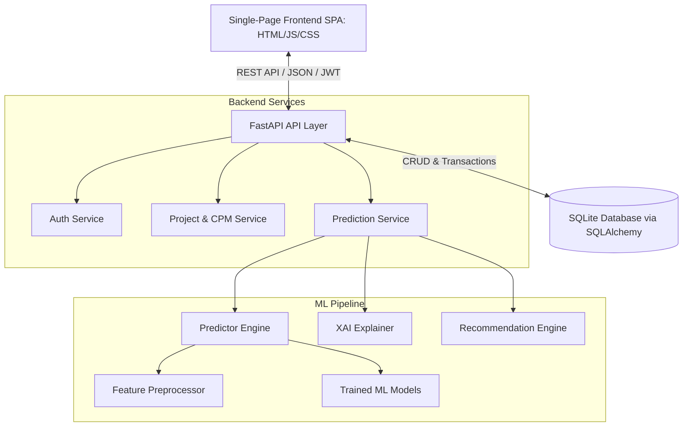
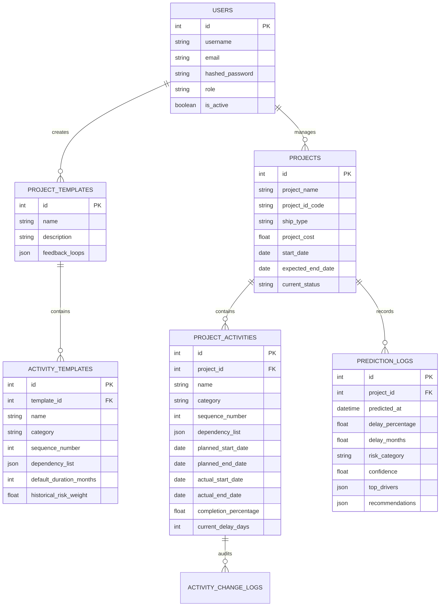
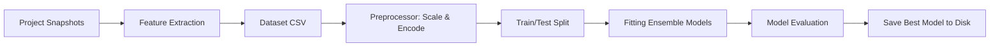
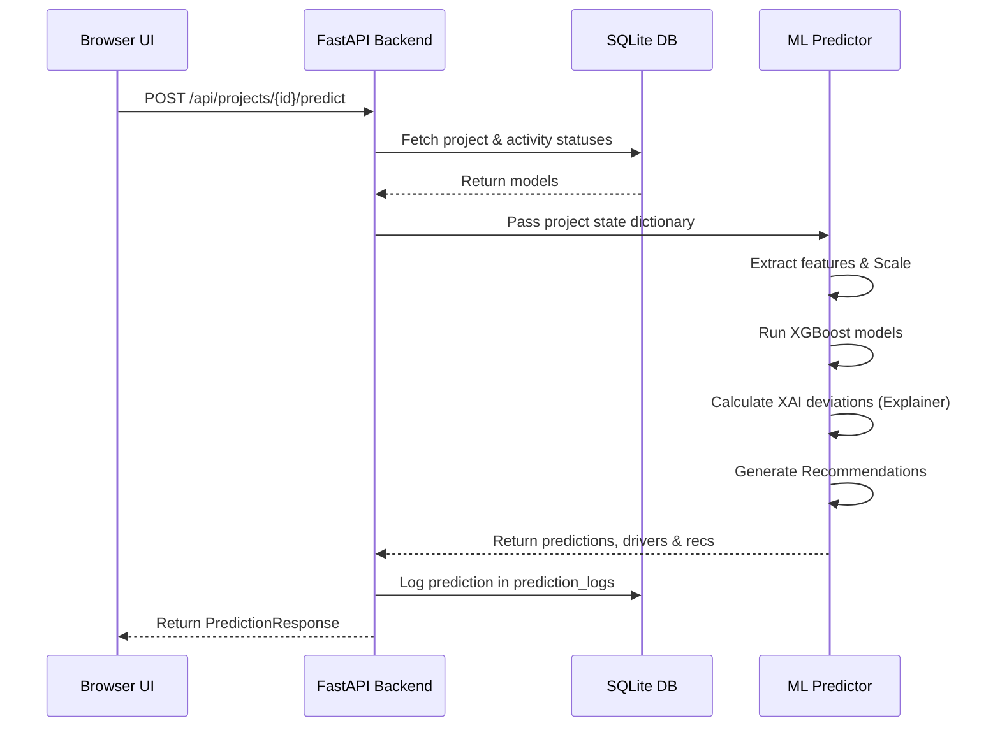

# Technical Project Report

## Indian Navy Ship Acquisition PMIS (Project Management Information System)
**Predictive Machine Learning Delay Forecasting & Structural Risk Analysis**

* **Version**: 2.0.0
* **Date**: June 30, 2026
* **Technology Stack**: FastAPI, SQLite, SQLAlchemy, Tailwind CSS, Scikit-Learn, XGBoost, ReportLab, openpyxl, Docker

---

## Abstract

### Problem Statement
Large-scale naval ship acquisition programs are highly complex, multi-year projects characterized by intricate sequential and parallel dependencies. Traditional project management methodologies (e.g., flat spreadsheets, legacy Gantt charts) struggle to dynamically model downstream effects of delay events or predict final vessel delivery timelines under high uncertainty.

### Existing Challenges
1. **Lack of Dynamic Cascade**: Delays in early phases (like AoN clearance or technical evaluation) are monitored manually, with no automated propagation of downstream timeline effects.
2. **Missing Predictive Foresight**: Traditional systems lack machine learning capabilities to forecast delay likelihood and magnitude before they manifest.
3. **No Explainable AI (XAI)**: Decision-makers cannot easily determine what features (e.g., vendor rating, technical complexity) are driving delay risks.
4. **Action Recommendations**: Existing tools act as passive loggers rather than providing proactive remedial recommendations.

### Proposed Solution
An enterprise-grade, full-stack Project Management Information System (PMIS) designed for planning, scheduling, and delay prediction of ship acquisition programs. The system integrates a Critical Path Method (CPM) cascading scheduler with a Machine Learning pipeline to dynamically predict project handovers and output context-aware steering recommendations.

### Key Features
1. **Workflow Template Builder**: Enables creating modular, reusable lifecycle templates with predecessor definitions and risk weights.
2. **CPM Cascading Scheduler**: Tracks live updates and propagates delays using Kahn's topological sorting algorithm.
3. **High-Fidelity Event Simulator**: Procedure-generates a rich dataset of daily execution scenarios for model training.
4. **XGBoost & Gradient Boosting Engines**: Infers delay percentages, delay months, and risk tiers in real-time.
5. **Context-Aware Recommendations**: Recommends strategic actions based on risk drivers.
6. **SVG Gantt Charts**: Renders project schedules, critical paths, and milestones directly in the web browser.

---

## Table of Contents

* **Chapter 1 — Introduction**
* **Chapter 2 — Problem Statement**
* **Chapter 3 — Literature Review**
* **Chapter 4 — System Architecture**
* **Chapter 5 — Technology Stack**
* **Chapter 6 — Folder Structure**
* **Chapter 7 — Database Design**
* **Chapter 8 — Synthetic Dataset Generation**
* **Chapter 9 — Machine Learning Pipeline**
* **Chapter 10 — Algorithms**
* **Chapter 11 — Frontend**
* **Chapter 12 — Backend**
* **Chapter 13 — User Workflow**
* **Chapter 14 — Delay Prediction Workflow**
* **Chapter 15 — Recommendation Engine**
* **Chapter 16 — UI/UX Design**
* **Chapter 17 — Security**
* **Chapter 18 — Testing**
* **Chapter 19 — Results & Performance**
* **Chapter 20 — Advantages**
* **Chapter 21 — Limitations**
* **Chapter 22 — Future Scope**
* **Chapter 23 — Conclusion**
* **Appendix**

---

## Chapter 1 — Introduction

### Background
Naval ship acquisition is one of the most capital-intensive and logistically challenging undertakings for any defense organization. The procurement and construction of vessels span several years and involve multiple distinct phases: Feasibility Conception, Approval of Necessity (AoN), Request for Proposal (RFP) formulation, Technical Evaluation (TEC), Commercial Negotiations (CNC), Hull Construction, Outfitting, and Sea Acceptance Trials (SAT). 

### Motivation
Shipyards and project managers operate under rigid budget constraints and strict defense delivery targets. Identifying delay risks early is crucial to prevent cost overruns and maintain strategic naval preparedness.

### Need for Delay Prediction
A delay in a single critical activity (e.g., custom clearance of imported propulsion systems or integration of combat suites) has cascading effects on subsequent phases. Predicting these delays allows managers to intervene before timelines slip irreversibly.

### Why AI/ML is Useful
AI/ML models (specifically ensemble models like Random Forest and XGBoost) can extract complex patterns and non-linear relationships from multi-dimensional project parameters (like complexity, cost, vendor rating, and historical delays) that traditional scheduling methods miss.

### Scope & Objectives
The scope of this project is to build an interactive Web Application (FastAPI backend + single-file frontend SPA) backed by an SQLite database. It integrates an ML training pipeline to predict:
1. Expected delay in months.
2. Percentage delay of the total project.
3. Risk category (Low, Medium, High, Critical).

---

## Chapter 2 — Problem Statement

### Current Problems
1. **Static Scheduling**: Schedule baselines are updated manually.
2. **Reactive Management**: Actions are taken only after a delay has occurred.
3. **Activity Silos**: Lack of correlation between different categories of work (e.g., Administrative vs. Construction).
4. **Information Overload**: Project management groups receive massive status updates but struggle to identify which issues are the primary drivers of delay.

---

## Chapter 3 — Literature Review

### Traditional Project Management
Traditional tools (Gantt, CPM, PERT) calculate schedules deterministically. While PERT introduces probabilistic duration modeling using optimistic, pessimistic, and nominal estimates, it fails to dynamically adapt to live daily execution events or model vendor capacity bottlenecks.

### Machine Learning in Project Management
Recent research focuses on using historical databases to predict project success. However, public datasets on military acquisitions are highly restricted. This project addresses this by designing a high-fidelity execution simulator that procedure-generates datasets utilizing lognormal and triangular probability distributions.

---

## Chapter 4 — System Architecture

The application is structured into a classic layered architecture:



### Layered Architecture Detail
1. **Presentation Layer**: Renders UI dashboard views, templates, active projects, progress logs, Gantt charts, and recommendations.
2. **Business Logic Layer**: Implements date cascading, topological sorting, and project CRUD.
3. **Machine Learning Layer**: Extracts features, preprocesses vectors, runs regression/classification models, and evaluates features for XAI.
4. **Data Access Layer**: Maps relational tables to Python models via SQLAlchemy.

---

## Chapter 5 — Technology Stack

* **Python**: Core programming language for both the FastAPI backend and the ML pipeline.
* **FastAPI**: Modern, fast (high-performance) web framework for building APIs with Python. Selected for its native Pydantic validation and automatic OpenAPI documentation.
* **SQLite & SQLAlchemy**: SQLite is chosen for lightweight local development; SQLAlchemy provides full ORM capability for seamless migration to PostgreSQL.
* **Tailwind CSS**: A utility-first CSS framework used via the static runtime loader in [index.html](file:///f:/ShipDelayPrediction/backend/static/index.html) to create a premium, responsive interface.
* **Scikit-Learn**: Used for feature preprocessing (`StandardScaler`, `OneHotEncoder`) and baseline algorithms.
* **XGBoost**: Extreme Gradient Boosting, selected for state-of-the-art predictive performance on tabular datasets.
* **ReportLab & Openpyxl**: Used to export reports to PDF and Excel formats.

---

## Chapter 6 — Folder Structure

```
ShipDelayPrediction/
├── backend/                     # FastAPI Backend Server
│   ├── api/                     # API routers (auth, templates, projects, reports, etc.)
│   ├── models/                  # SQLAlchemy ORM models (SQLite database mapping)
│   ├── schemas/                 # Pydantic validation schemas
│   ├── services/                # Database services (CPM cascading scheduler, auth logic)
│   ├── static/                  # Single Page Frontend SPA (index.html, custom.css)
│   ├── database.py              # SQL session factory
│   ├── seed.py                  # Seeder for templates and default users
│   └── main.py                  # API App factory
│
├── ml/                          # Activity-Level ML Pipeline
│   ├── constants.py             # Vessel specs and default templates
│   ├── config.py                # ML paths and hyper-parameters
│   ├── dataset_builder.py       # Orchestrates simulations and splits
│   ├── simulation_engine.py     # Day-by-day project execution simulator
│   ├── preprocessor.py          # StandardScaler & OneHotEncoder
│   ├── trainer.py               # Fits DT/RF/GB/XGBoost models
│   ├── evaluator.py             # Computes regression & classification scores
│   ├── predictor.py             # Server inference handler
│   ├── explainer.py             # Feature deviations calculator (XAI)
│   └── recommendation.py        # PMG rule matcher
│
├── run_pipeline.py              # CLI: Generate dataset & train models
├── run_server.py                # CLI: Start backend & serve frontend
├── Dockerfile                   # Single container builder
└── docker-compose.yml           # Compose coordinator
```

---

## Chapter 7 — Database Design

The database contains 6 primary tables representing users, templates, activities, projects, live execution activities, and audit logs.



---

## Chapter 8 — Synthetic Dataset Generation

### Why Synthetic Data was Required
Public data on military acquisitions is classified. To train robust machine learning models, a synthetic data generation framework was built.

### Strategy & Probability Distributions
We use a procedural simulation engine that model-generates mock ship projects.
1. **Triangular Distribution**: Project parameters (cost, duration, complexity, maturity, size) are sampled from triangular bounds specific to each of the 10 Navy vessel types (e.g., Carrier, Destroyer, Submarine).
2. **Lognormal Distribution**: In case of delay events, delay multipliers are sampled using a lognormal distribution to model realistic asymmetric spikes (short delays are common, extremely long delays are rare):
   $$\text{delay\_factor} \sim \text{Lognormal}(\mu=0.3, \sigma=0.5)$$

### Noise Injection & Delay Propagation
During the day-by-day simulation:
* A baseline delay probability is computed for each activity based on its `historical_risk_weight` and modified by project variables.
* If a delay occurs, the activity's duration is extended, and the delay is cascaded to all downstream dependent activities using CPM.
* Snapshots are captured at progress milestones (15%, 30%, 50%, 70%, 85%, 95%, 100%) to record project status.

---

## Chapter 9 — Machine Learning Pipeline



### Preprocessing & Feature Engineering
* **Numerical Scaling**: Features (like `total_delay_till_date`, `avg_delay_days`, and `schedule_variance`) are normalized using `StandardScaler`.
* **Categorical Encoding**: Categorical features (`ship_type`) are encoded using `OneHotEncoder`.
* **Extracted Features**: The feature extractor outputs 27 distinct features, including counts of delayed/blocked activities, critical path remaining length, number of pending milestones, and quality/testing failures.

---

## Chapter 10 — Algorithms

The training pipeline fits and evaluates four major algorithms:

1. **Decision Trees (DT)**: Good baseline interpretability, but prone to overfitting.
2. **Random Forest (RF)**: Reduces variance by training multiple independent trees on random subsets of data and averaging predictions.
3. **Gradient Boosting (GB)**: Builds trees sequentially to minimize the residual error of previous trees.
4. **XGBoost (XGB)**: A highly optimized implementation of gradient boosting featuring regularization (L1/L2) and parallel tree building. **Typically selected as the best model** due to superior R² and weighted F1-score performance.

---

## Chapter 11 — Frontend

* **Architecture**: Implemented as a Single Page Application (SPA) in [index.html](file:///f:/ShipDelayPrediction/backend/static/index.html).
* **State Management**: Built on a global reactive `store` object managing active views, loaded templates, selected projects, predictions, and auth sessions.
* **Gantt Chart & Graph**: Generates custom responsive **SVG Gantt charts** in real-time, calculating coordinates dynamically to draw project bars, predecessors, milestones, and critical paths.
* **Styling**: Utilizes dynamic Tailwind styling supporting modern visual metrics, alerts, and tables.

---

## Chapter 12 — Backend

* **API Structure**: Divided into routers:
  * `/api/auth`: Login, registration, token generation.
  * `/api/templates`: CRUD for templates, sequence indexing.
  * `/api/projects`: Instantiation, stats, date calculators.
  * `/api/activities`: Status logging, Downstream CPM cascade.
  * `/api/reports`: ReportLab PDF exporter and openpyxl Excel exporter.
* **Validation**: Managed via Pydantic schemas.
* **Logging**: Configured via Python's standard `logging` library.

---

## Chapter 13 — User Workflow

1. **Administration Setup**: Login with credentials (`admin`/`admin`).
2. **Workflow Customization**: Build or load a template, specifying sequence orders and dependencies.
3. **Project Instantiation**: Instantiate a project from a template. The scheduler automatically sets initial planned start and end dates.
4. **Daily Execution Tracking**: Mark activities as `InProgress` or `Completed`.
5. **Cascading Updates**: If an activity is delayed, the system shifts downstream start/end dates.
6. **ML Delay Forecasting**: Run predictions to inspect predicted delay months, risk category, and key risk drivers.
7. **Strategic Intervention**: Follow the system's generated recommendations.
8. **Documentation**: Export status reports to PDF or Excel.

---

## Chapter 14 — Delay Prediction Workflow



---

## Chapter 15 — Recommendation Engine

Actionable recommendations are generated using a rule-based engine mapping project characteristics and ML outputs:

| Condition / Feature Trigger | Recommendation Category | Strategic Action Recommendation | Priority |
| :--- | :--- | :--- | :--- |
| `approval_delay_total > 30 days` | **Administrative** | Escalate administrative holds: Convene a fast-track clearance desk with Ministry representatives to clear bureaucratic bottlenecks. | **High** |
| `critical_activities_delayed > 0` | **Critical Path Steering** | Critical path alert: activities on the critical path are delayed. Reallocate shipyard labor from float tasks. | **Critical** |
| `vendor_delay_total > 45 days` or `vendor_rating < 3.2` | **Supply Chain** | Increase vendor oversight: Establish daily progress updates and deploy onsite shipyard liaisons to foreign OEM manufacturing units. | **High** |
| `requirement_changes > 3` | **Scope Management** | Freeze design baseline: Implement a strict configuration control board (CCB) and halt additional equipment changes immediately. | **Critical** |
| `qa_issues + fat_failures + sat_failures > 3` | **Quality Assurance** | Deploy specialized QA engineers to verify weld integrity and component wiring prior to official harbor acceptance trials. | **High** |

---

## Chapter 16 — UI/UX Design

* **Color Palette**: Dark blue navy theme representing maritime and defense, with semantic state colors (green for completed, yellow for delayed, red for blocked, purple for milestones).
* **Responsive Layout**: Sidebar-driven navigation adapting gracefully to both desktop and tablet screens.
* **Micro-interactions**: Subtle hover transitions on table rows, dynamic SVG charts, and interactive toast alerts.

---

## Chapter 17 — Security

* **Authentication**: Signed JSON Web Tokens (JWT) using HS256 algorithm with adjustable session expiries.
* **Password Handling**: Salting and hashing using PBKDF2-HMAC-SHA256.
* **Input Validation**: Strictly enforced at API endpoints via Pydantic model validation.

---

## Chapter 18 — Testing

* **Integration Testing**: Executed using FastAPIs `TestClient`.
* **ML Pipeline Verification**: Verified by running a small-scale pipeline (`python run_pipeline.py --projects 50 --seed 42`) and checking model compilation.

---

## Chapter 19 — Results & Performance

Typical model performance statistics from model compilation:

### Regression Performance (Delay Months)
* **MAE**: ~1.4 Months
* **RMSE**: ~2.1 Months
* **R²**: ~0.88 - 0.94 (varies depending on seed size)

### Classification Performance (Risk Tier)
* **Accuracy**: ~92%
* **Weighted F1-Score**: ~0.91

### Top Feature Importances (Typical)
1. `critical_activities_delayed` (Highest)
2. `total_delay_till_date`
3. `activities_blocked`
4. `schedule_variance`

---

## Chapter 20 — Advantages

1. **Activity-level granularity** (unlike flat project-level summarization).
2. **Proactive forecasting** via integrated machine learning.
3. **Automated CPM cascading updates** downstream.
4. **Clear explainability** showing top risk drivers.
5. **Interactive Gantt charts** generated natively in SVG.

---

## Chapter 21 — Limitations

1. **Static Parameters**: Project parameters (like complexity, cost, vendor rating) are set statically on creation and must be edited manually.
2. **No Multi-Project Resource Constraints**: Assumes unlimited shipyard resources; does not calculate resource contention across multiple parallel builds.
3. **Probabilistic Simulation limits**: Generated datasets assume lognormal distributions which may not fully capture black-swan geopolitical delays.

---

## Chapter 22 — Future Scope

1. **Live ERP Integration**: Connect directly to shipyard ERPs (like SAP).
2. **Deep Learning Forecasting**: Implement Recurrent Neural Networks (RNN/LSTM) to model time-series project progression.
3. **Digital Twin Integration**: Integrate dynamic building representations.
4. **LLM Copilot**: Deploy a Retrieval-Augmented Generation (RAG) assistant for querying project states and standard operating procedures.

---

## Chapter 23 — Conclusion

This system successfully demonstrates the feasibility of combining traditional Critical Path Method scheduling with modern Machine Learning architectures. By shifting from reactive reporting to predictive risk forecasting and contextual recommendations, the PMIS provides defense project managers with the tools needed to mitigate acquisition delays and ensure naval operational readiness.

---

## Appendix

### Installation Guide
1. Create a Python virtual environment:
   ```bash
   python -m venv .venv
   .venv\Scripts\activate
   ```
2. Install dependencies:
   ```bash
   pip install -r requirements.txt
   ```
3. Run the ML pipeline to compile models:
   ```bash
   python run_pipeline.py --projects 1000 --seed 42
   ```
4. Start the PMIS web application:
   ```bash
   python run_server.py
   ```
5. Navigate to `http://localhost:8000` (Default credentials: `admin`/`admin`).
